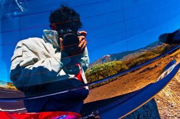

Os dejo un enlace más adelante a mi pase de fotos de Tenerife y Lanzarote . A principios de mes estuve en estas dos bonitas islas del Atlántico con mi cámara para sacar algunas fotos.

De estas dos islas, os recomiendo: el [Parque Nacional del Teide](http://www.blogger.com/reddeparquesnacionales.mma.es/parques/teide/index.htm), que es algo impresionante, el norte de Tenerife y sus [Montes de Anaga](http://www.sctfe.es/index.php?id=351) y de Lanzarote d[irigirse a las playas del norte un día con olas](http://www.lanzarote.com/surf/index-es.html) y disfrutar del ambiente surfero de la isla.  
Aquí va el pase de diapos:  
[http://www.flickr.com/photos/lluisr/sets/72157612677970896/show/](http://www.flickr.com/photos/lluisr/sets/72157612677970896/show/)