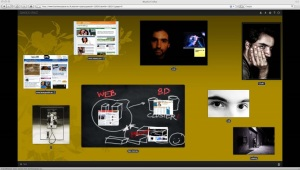

Estoy probando una tableta digitalizadora [Bamboo](http://www.wacom.com/bambootablet/bamboofun.php). Muy buena, pero este post no está relacionado tanto con el dispositivo sino con una aplicación que viene incluído en el software.Es una aplicación web, que la llaman [BambooSpace](http://www.bamboospace.eu/) que permite crearte como un tablón de corcho de esos que tenemos/hemos tenido en nuestras habitaciones o estudios alguna vez.  
Este espacio te permite poner fotos, web, post-it, videos y unos espacios donde dibujar cualquier cosa distributendo los elementos de forma natural. La intención es demostrar las potencialidades de la tableta porque con ella el manejo de este tablón es mucho más intuitivo y “humano”. Además añade el componente social podiendo compartir este tablón con otros usuarios de BambooSpace. Os incluyo una captura de pantalla:

  
Estoy seguro que pronto este tipo de lugares en la web serán más habituales, porque el hardware con dispositivos de entrada táctil, como son las pda, los tablet pc o los ordenadores con pantalla táctil serán más frecuentes:

  

Y la posibilidad de tener interficies más dinámicas en la web no serán obviadas.

Por cierto, he seguido usando un poco el [BumpTop](http://bumptop.com/) en un [TabletPC](http://es.wikipedia.org/wiki/Tablet_PC). Lamentablemente, el tablet, un [Dell Latitude XT](http://www1.euro.dell.com/content/products/productdetails.aspx/latit_xt?c=es&l=es&s=bsd&cs=esbsdt1), se queda un poco corto de prestaciones y además tengo el problema que no puedo apoyar la mano sobre la pantalla sin que interfiera, y por tanto creo que no le saco todo el jugo. Estoy a la espera que salga la versión para [Mac OS X](http://www.apple.com/macosx), pero no lo hace lo que me hace sospechar que para futuras versiones de Mac OS X y los nuevos portátiles con pantalla táctil, [Apple](http://www.apple.com/) ya ha adquirido alguna patente de BumpTop y solo lo podremos ver funcionarlo en Mac OS X como un componente propio más del sistema. Algo pasó con [CoverFlow](http://es.wikipedia.org/wiki/Cover_Flow), tal como explicaba en un post antiguo, era una [aplicación que te permetía ordenar tu música con una interficie muy bonita con reflejos como si de un tocadisco de bar se tratara](http://lluisr.blogspot.com/2006/04/navegar-por-los-cd-de-musica-de-tu-mac.html). Pasado unas semanas, la web del programa dejó de publicar el sofware sin motivo alguno y pasado unos meses, la nueva versión de [iTunes](http://www.apple.com/es/itunes/) lo incorporaba.