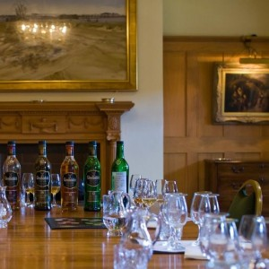
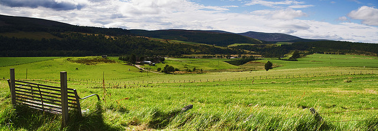

  
[Mostra un mapa més gran](http://maps.google.es/maps?f=d&hl=ca&geocode=17086831743759661726,57.647120,-3.333920&saddr=Drumnadrochit&daddr=W+Rd%2FA96+%4057.647120,+-3.333920+to:57.441993,-3.117371+to:Blairgowrie&mra=dpe&mrcr=0&mrsp=2&sz=9&via=1,2&doflg=ptm&sll=57.311691,-3.153076&sspn=0.728314,1.60675&ie=UTF8&ll=56.910127,-3.486099&spn=5.892799,12.854004&source=embed)  

  

Me levanto en un día cubierto y me dirigo más al este, para entrar en una de las zonas con más distelerías de Escocia. Esta zona está situada alrededeor de la población de [Dufftown](http://en.wikipedia.org/wiki/Dufftown), en la lengua de tierra que se adentra en el [Mar del Norte](http://es.wikipedia.org/wiki/Mar_del_Norte). Aquí, en los puestos de información se puede pedir información a cerca de la [Ruta del Whisky de Malta](http://www.maltwhiskytrail.com/) aunque yo ya tenía una ruta realizada: [El día que dormí en Cannich](http://lluisr.blogspot.com/2008/08/dia-8-escocia.html), en el desayuno una familia francesa me recomendó l a distelería [MacCallan](http://www.themacallan.com/). Entre otras cosas porque hacía visitas gratuitas a sus instalaciones pero cual fue mi desilusión cuando llegué y el pago de 10£ era obligatorio para la visita.Más que enojado, sorprendido, decidí ir a buscar otra distelería. Tenía muchas posibilidades: [Mortlach Distillery](http://www.scotchwhisky.net/distilleries/mortlach.htm), [Parkmore Distillery](http://www.wormtub.com/distilleries/distillery.php?distillery=Parkmore), [Gledullan Distillery](http://www.scotchwhisky.net/distilleries/glendullan.htm), [Balvenie Distillery,](http://www.thebalvenie.com/) [Convalmore Distillery](http://www.scotchwhisky.net/distilleries/silent/convalmore.htm)… pero finalmente escogí ir a visitar [Glenfiddich Distellery](http://www.glenfiddich.com/lda.html?redirect=/index.html).  
Glenfiddich es una de las marcas de whisky de malta más internacionales y extendidas por todo el mundo entero. Y es el único whisky de la zona que todo el proceso del incluyendo el embotellamiento lo realiza la misma distelería. Por tanto, es un buen lugar para conocer este mundo. Me recuerdo que me perdí para encontrar la distelería, que las indicaciones no eran muy exactas, pero al final lo encontré aparcando mi precioso coupé entre autobuses de turistas. Eran aproximadamente las diez y las instalaciones rebosaban de gente. Motivo de más para escoger la visita exclusiva llamada Connoisseur’s Tour. Por suerte no había una lista de espera aquel día.  

<figure id="attachment_2185" aria-describedby="caption-attachment-2185" style="width: 290px"><figcaption id="caption-attachment-2185">Gleenffidich – Lluís Ribes i Portillo (<a href="http://creativecommons.org/licenses/by-nc-nd/3.0/" target="_blank" rel="noopener noreferrer">cc</a>)</figcaption></figure>

  
El Connoisseur’s Tour es una visita extendida a la normal (unas dos horas), con una cata de whiskyes en el salón de invitados de la fábrica. Es una visita que se me hizo un pelo corta, pero fue muy divertida y didáctica. Sinceramente, en mi vida había catado un whisky más allá de hacerlo dentro de un [tubo de cristal con Coca-Cola](http://www.pobladores.com/channels/comer_y_beber/Cubatas_Ivan/area/1/subarea/2) (o [Pepsi…](http://www.youtube.com/watch?v=q4fUlkXPHKE)). Me recuerdo como el grupo de guiris que eramos nos sentamos en la preciosa mesa de madera de la sala y la guía, una señora mayor, gordita con una media melena canosa y una piel blanca de tonos rojos nos iba indicando como tastar un Glenfiddich  
de 12,15,18 y 21 años. La idea era mezclar el wisky con 2/3 de agua mineral para liberar los aromas y adivinar el aroma característico de cada uno. Había una chica de Australia que los acertó todos: que si tiene una caída a pera (el de 12 años), a miel (el de 15 años), a roble (el de 18 años) o a plátano (el de 21 años). La guía sorprendida le preguntó en qué trabajaba, ella respondió que era química… Por contra, delante mio tenía una pareja de hombres belgas, rojos como tomates que a cada sorbido gemían un llanto de placer como si de un micro orgasmo se tratara. Y yo, el de Barcelona, el de las [playas y el sol,](http://www.beachbarcelona.com/) [la sangría](http://www.recetasgratis.net/Sangria-busqCate-1.html) [los toros](http://www.streetdirectory.com/travel_guide/209630/europe_destinations/bullfighting_in_barcelona_culture_or_cruelty.html) y el [vino tinto](http://images.google.es/images?hl=es&client=firefox-a&rls=org.mozilla:es-ES:official&hs=VS&q=vino&um=1&ie=UTF-8&sa=N&tab=wi), haciéndome el entendido con la cata, qué surrealista! Pero divertido y una visita recomendada. Además, a mi me ha permitido tras mi instrucción, el poder pedir algo diferente que un [JB](http://www.jbonline.es/controlEdad.php) o [Cardhu](http://www.sensacionescardhu.com/) en un sobremesa y decir tonterías sobre su aroma, procedencia, fabricación… 🙂  
Y tras la cata, descansé un poco en las praderas verdes y agarré el coche hacia el sur atravesando las [Grampian Mountains](http://en.wikipedia.org/wiki/Grampian_Mountains). Aquí quizá cometí un error, porque siendo el día 8 podría haberme ido hacia la costa, hacia [Aberdeen](http://en.wikipedia.org/wiki/Aberdeen) y sus alrededores, una espléndida zona de Escocia. Y hubiera tenido días de sobra, pero esto es lo que tiene viajar sin una ruta fijada. Ya volveremos otro año.

<figure id="attachment_2184" aria-describedby="caption-attachment-2184" style="width: 630px"><figcaption id="caption-attachment-2184">Banco – Lluís Ribes i Portillo (<a href="http://creativecommons.org/licenses/by-nc-nd/3.0/" target="_blank" rel="noopener noreferrer">cc</a>)</figcaption></figure>

Atravesar las Grampian Mountains en verano con coche no tienen nada más especial que atrevesar una extensa zona de pequeños montículos, con baja vegetación a excepción de los frondosos valles, y con una carretera sinuosa que sube y baja, sube y baja… es muy bonito, que os voy a contar a estas alturas. La ruta que seguí fue la A939 y la A93 hasta llegar a [Blairgowrie](http://en.wikipedia.org/wiki/Blairgowrie_and_Rattray) a la tarde.  
La verdad es que pensaba que había llegado a [Perth](http://en.wikipedia.org/wiki/Perth,_Scotland), un poco más al sur, donde tenía ya visto algunas recomendaciones de B&B. Tal fue mi despiste que cuando salí por el pueblo a la noche me guiaba con un pequeño mapa de Perth en la guía. Pero es que era igual, un pueblo con un río, la zona de bares se situaba alrededor del puente, el B&B donde estaba coincidía en situación con uno que estaba marcado en el mapa…  
Pero fue de maravilla confundirme, porque en Blairgowrie encontré uno de los mejores B&B con diferencia del viaje: Rosebank House. Y es que la amabilidad con la que me trataron los propietarios tanto Sue como Charles fue increíble. No es un B&B de lujo, pero el trato lo es todo. Hasta se ofrecieron a hacerme toda la colada que tenía pendiente. El Rosebank House se sitúa entrando por la A93 desde el norte a la izquierda antes de llegar a Stop con un desvío al centro del pueblo. Es una casa grande de dos plantas, con un amplio jardín y un aparcamiento privado. El precio, muy ajustado: 27£ la habitación individual con ducha propia.  
Sin duda un excelente lugar para descansar.  
B&B  
  
Rosebak House  
Balmoral Road  
Perthshire  
Ph10 7af  
Tel: 01250872912  
mail: colhotel@rosebank35.fsnet.co.uk  
web: [www.smoothhound.co.uk/hotels/rosebankh.html](http://www.smoothhound.co.uk/hotels/rosebankh.html)  
Precio individual: 27 £  
Fotos  
PD: espero finalizar mis artículos del viaje a Escocia algún día. Aun me quedan 3 días, a este ritmo para el próximo verano los tengo listos, o no…, pero la verdad es que se me hace cuesta arriba cada día nuevo que escribo. Pero todo por mis lectores, pocos pero los mejores.