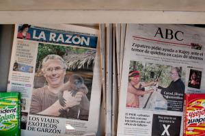

  
Mientras muchos diarios hoy la noticia y foto principal de la portada era [el éxito del tratamiento de la enfermedad de Andrés gracias al uso del cordón umbilical de su pequeño hermano](http://www.20minutos.es/noticia/456596/0/curado/bebe/medicamento/), otros diarios (como los de la foto de arriba…) tenían en portada otras noticias bien diferentes. Y llego a una conclusión: “Cada loco con su tema”  
La foto en original con todos los detalles: [Ampliar foto](http://farm4.static.flickr.com/3452/3354993718_c07c46f4a7_o.jpg)