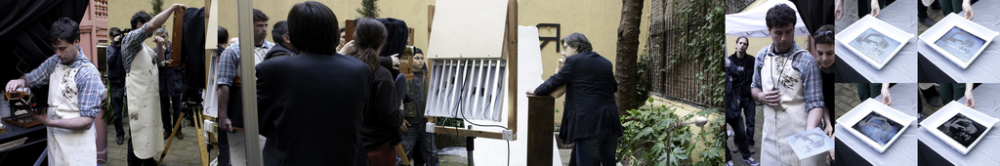

  
El [Colodión](http://en.wikipedia.org/wiki/Collodion_process) es un proceso fotográfico del siglo XIX que se popularizó mucho. Podéis verlo en acción el próximo sábado 21-3-09 en la librería [Kowasa](http://www.kowasa.com/). Dejo links:  
– [Toda la información del evento en PhotoBloggers Barcelona](http://barcelona.photobloggers.org/2009/03/09/kowasa-collodion-garden/)  
– [Galeria de fotos de **ntfxs** del dia de hoy de la demostración en Kowasa](http://www.flickr.com/photos/ntfxs/3353123395/)  
– [Video completo del proceso](http://www.atelieretaguardia.com/videos/video_ColodionH.html)  
– [La teoria](http://www.pbs.org/wgbh/amex/eastman/sfeature/wetplate_step1.html)