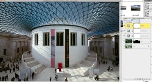
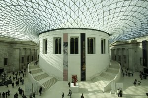
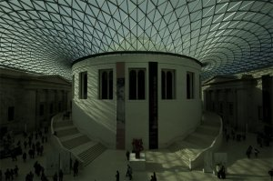
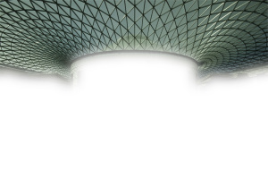
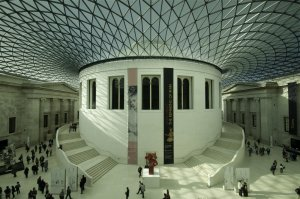
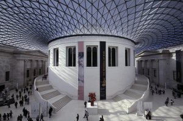
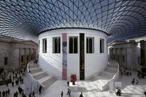
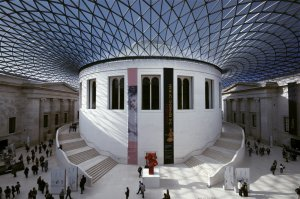

Os dejo un mini tutorial de [Photoshop CS](http://es.wikipedia.org/wiki/Adobe_Photoshop) de como combinar varias fotos para obtener una foto con una buena exposición. Ideal en aquellos casos que nos enfrontamos con una escena con contrastes de luz y sombras muy elevados. Por ejemplo, la siguiente: el [Great Court del Museo Británico](http://en.wikipedia.org/wiki/Queen_Elizabeth_II_Great_Court), un interior con poca luz en comparación al exterior de la cúpula.

  
Objetivo: tener una foto con detalles tanto del interior, como del exterior. Para este ejemplo, con dos fotos nos valdrá.El primer paso, es disparar las dos fotos con trípode y sin mover la posición de la cámara exponiendo una foto correctamente para el interior, y la otra foto exponiendo correctamente para el cielo.

Medimos la luz en el interior

Medimos la luz en la cúpula

Dos, las cargamos cada foto en PS, y las copiamos cada una en una capa de un fichero nuevo de PS.  
Tres, manos a la obra. Seleccionamos la que queda está en la capa superior y seleccionamos la zona que queremos de ella para crear a posterior una máscara. En nuestro caso, seleccionamos la cúpula (por ejemplo con la “Herramienta de Lazo”, sin miedo) y creamos la máscara con “Añadir máscara Vectorial”. Consejo: una vez creada la máscara, para suavizarla la selecionamos y aplicamos un “Filtro Desenfoque Gaussiano”.

La capa que le hemos creado la máscara

Y ya está!

Resultado final

Si nos fijamos, podemos observar como en la foto final podemos ver todos los detalles del interior pero del exterior también como es el caso de la la parte superior de la torre. Sin usar este método del tutorial, probablemente hubiera quedado sobreexpuesta o quemada (es decir, prácticamente blanca sin detalles) y no se contemplaría los detalles, o la nube que está a su derecha.  
En este ejemplo además incorporo tres capas más para acabar de darle el toque personal:

Balance de blancos: casi nunca lo ajusto en la cámara. Para ello me aseguro de usar formatos Raw y después con una “Capa de Curvas” y su “Cuentagotas Gris” selecciono el blanco. Para el ejemplo, la luz de que se proyecta en el lado izquierdo de la torre parece un buen candidato de blanco.

Blancos ajustados

Ajusto colores: ajusto los colores con una capa de “Corrección selectiva”, lo que me permite darles a cada color la tonalidad que busco

Me gustan los azules con fuerte componente Cian

Un poco de alegría: uso una capa Tono/Saturación para elevar la saturación y darle más vida a la foto. Fijaros en el rojo de la escultura.

Un poco de saturación.

Podéis descargar una versión del fichero PhotoShop con las capas en 1024 (6Mb) aquí: [British Museum Low.psd](http://lluisribes.googlepages.com/BritishMuseumlow.psd)  
Pronto subiré la versión PhotoShop original si encuentro la forma de colgar 126MB!

  
  
El resultado final en alta resolución