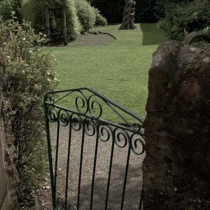
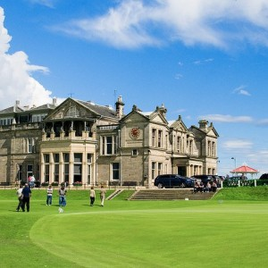
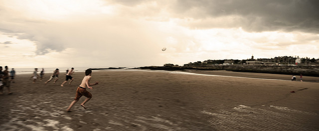
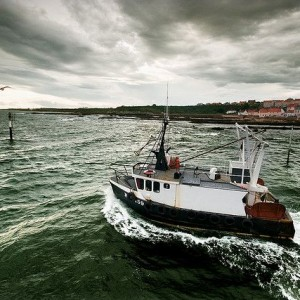

  
[Mostra un mapa més gran](http://maps.google.es/maps?f=d&hl=ca&geocode=12126510656394950059,56.363910,-3.419860%3B14393316752279618440,56.214340,-2.729940%3B8051989474956583655,56.296630,-2.658020%3B7355209068724934400,56.342160,-2.803430&saddr=Blairgowrie&daddr=Glamis+to:Dundee+to:Blairgowrie,+Perth+and+Kinross,+UK+to:M90+%4056.363910,+-3.419860+to:56.197919,-3.426361+to:A917%2FJames+St+%4056.214340,+-2.729940+to:A917+%4056.296630,+-2.658020+to:A91%2FLinks+Crescent+%4056.342160,+-2.803430&mra=dpe&mrcr=4&mrsp=5&sz=11&via=5,6,7&doflg=ptm&sll=56.25632,-3.247147&sspn=0.187275,0.401688&ie=UTF8&ll=56.255557,-4.020996&spn=5.995365,12.854004&source=embed)

 El décimo día me levanto tarde. La verdad es que en el [Rosebank House](http://www.smoothhound.co.uk/hotels/rosebankh.html) descansé mucho y tomé la decisión de pasar otra noche para no tener que preocuparme aquel día de buscar alojamiento.

A esas horas, en el desayuno solo quedan los caseros. Sue, la señora, me sirve amablemente la comida en el comedor. Aprovecho para preguntar por alguna ruta a hacer y Sue me dice que una vez finalizado el desayuno que hable con su marido Charles. Así hago, acabo y llamo a Charles que estaba en el despacho. Charles es un tipo curioso pero entrañable. Cojea y tanto que parece que en cada paso vaya a caer, pero no, su cuerpo rápidamente agarra una posición conservando el equilibrio, eso si, sin dejar mucho pasar mucho tiempo antes que se apoye con su brazo con alguna pared.

Así como Sue es reservada y parece que te esté susurrando todo el rato a los oídos, Charles le encanta hablar con su voz entrecortada y al saber que soy de Barcelona se entusiasma más y me enseña el mapa de la zona que tiene en la entrada. Todo orgulloso me explica que él es de un pueblo costero cercano al que me recomienda ir, se llama [Pittenweem](http://en.wikipedia.org/wiki/Pittenweem) y donde hacen el mejor [Fish&Chips](http://en.wikipedia.org/wiki/Fish_%26_chips) de todo Reino Unido. Pero obviamente, me recomendó como llegar a su ruta realizando un ruta interesante con coche para visitar lugares de interés de la zona, comenzaba el Camino de Charles:

Camino de Charles  

> <figure id="attachment_2195" aria-describedby="caption-attachment-2195" style="width: 290px"><figcaption id="caption-attachment-2195">Barrier’s Garden – Lluís Ribes i Portillo (<a href="http://creativecommons.org/licenses/by-nc-nd/3.0/" target="_blank" rel="noopener noreferrer">cc</a>)</figcaption></figure>
> 
> Dejo el B&B, las calles estaban empapatadas de una tormenta de la noche y la primera parada que realizo es en [Kirriemur](http://en.wikipedia.org/wiki/Kirriemuir), a 20km de Blairgowrie por la A926. Mucha gente se preguntará qué se ha perdido en este pueblecito sin ningún encanto especial. Pues bien, aquí se han perdido millones de niños y no niños también. En una de sus casas, [Peter Pan](http://en.wikipedia.org/wiki/Peter_Pan) y el [País de Nunca Jamás](http://en.wikipedia.org/wiki/Neverland) fueron creados. En Kirriemur nació y vivió [J.M. Barrie](http://en.wikipedia.org/wiki/J._M._Barrie), y también escribió su obra más famosa en el estudio de su casa. Su casa, se puede visitar aunque yo no pude porque estaba cerrada ese día. Pero pude atravesar la puerta que daba entrada al pequeño jardín trasero dedicado al País del Nunca Jamás…
> 
>   
> …a la vuelta del País de Nunca Jamás, me dirigí a [Glamis](http://en.wikipedia.org/wiki/Glamis) por la A928. En el se situa el [Castillo de Glamis](http://www.glamis-castle.co.uk/), que es un lugar de residencia estival de la familia real. Como todo buen castillo que se precie, tiene unos jardines magníficos. El castillo en sí, es de una piedra rojiza, grande y majestuoso. Este castillo está dentro de los recorridos turísticos, por tanto ya podéis esperaros que hay: un parquing lleno de coches, familias comprando souvenirs en la tienda y una visita guiada en grupo al castillo, como no, y pagando, como no otra vez. Yo me apunté a la visita, y está bien. Recorre las diferentes estancias, la cual más ostentosa: desde el comedor con su gran mesa de madera noble y la cubertería de plata, pasando por sala de estar lleno de retratos regalos de familias reales, la biblioteca y su piano de marfil blanco o la sala de trofeos ([abstenerse aquellos que creen firmemente en las causas contra la guerra o la caza de animales)](http://www.greenpeace.org/international/). Curioso también la visita a las habitaciones reales, donde la reina duerme cuando pasa unos días. Ahora bien, como detalle, todo este glamour contrasta con la guía que te dan traducida a un castellano patético. Me dió ganas de pedirles el documento Word para pasarle el corrector ortográfico.
> 
> Pero la visita vale la pena, siempre y cuando estés dispuesto a gastar unas horas en algo típico de guiris.
> 
> Con el castillo, casi pasó la mañana y me dirigí al sur, hacia mi siguiente parada: [St. Andrews](http://en.wikipedia.org/wiki/Saint_Andrews). Para llegar desde Glamis, el camino más rápido es dirigírse a la A90 y atravesar la ciudad más grande de la zona, [Dundee](http://en.wikipedia.org/wiki/Dundee), donde un puente cruza una gran lengua de agua por [un largo puente paralelo](http://en.wikipedia.org/wiki/Tay_Road_Bridge) al [Tail Rail Bridge.](http://en.wikipedia.org/wiki/Tay_Rail_Bridge) Pasado el puente, en 2km. se deja atrás la autovía para entrar a conducir por unas carreteras estrechas y campestres, la A914 y A91, hasta St. Andrews.
> 
> <figure id="attachment_2193" aria-describedby="caption-attachment-2193" style="width: 290px"><figcaption id="caption-attachment-2193">St. Andrews – Lluís Ribes i Portillo (<a href="http://creativecommons.org/licenses/by-nc-nd/3.0/" target="_blank" rel="noopener noreferrer">cc</a>)</figcaption></figure>
> 
> Era domingo, y St. Andrews rebosaba de gente. Es la cuna del Golf, y en el se sitúa el legendario [Old Course Golf](http://www.oldcourse-experience.com/) y los domingos al estar cerrado puedes pasear por sus calles como si fueras por el campo. Sí, caminar por las calles del golf, porque en realidad no es más que una basta zona verde del pueblo, nada que ver con cualquier otra idea de un campo de golf cerrado por vallas y con agentes de seguridad en la entrada. Es una sensación muy curiosa caminar por el césped verde del campo, por tanto os recomiendo que si queréis visitar St.Andrew, reservaros un domingo para ello.
> 
> A parte del campo de golf, justo al lado está la gran playa famosa porque en ella se rodó l[a escena introductoria](http://www.youtube.com/watch?v=L-7Vu7cqB20) de [“Carro de Fuego”](http://www.imdb.com/title/tt0082158/). Allá capté una de mis fotos preferidas del viaje, unos niños jugando a rugby.
> 
> <figure id="attachment_2197" aria-describedby="caption-attachment-2197" style="width: 630px"><figcaption id="caption-attachment-2197">Playa de St. Andrews – Lluís Ribes i Portillo (<a href="http://creativecommons.org/licenses/by-nc-nd/3.0/" target="_blank" rel="noopener noreferrer">cc</a>)</figcaption></figure>
> 
> La visita a St Andrews la completé con el museo del golf, nada del otro mundo y con la exclusiva y coqueta tienda del [Old Course Course](http://shop.standrews.com/), parada obligada para comprar cualquier recuerdo auténtico de golf.
> 
> La tarde comenzaba, y un poco de lluvia comenzaba a caer y salí rápidamente hacia la siguiente parada del Camino de Charles: Pittenweem a través de la carretera de la costa A917.
> 
> Al llegar a Pittenweem, la encuentro un tanto desértica y triste. Eran alrededor de las 17:00 horas, y hasta el pequeño puerto estaba excento de vida. Había llegado tarde, por la mañana hubo el último día del [Pittenweem Arts Festival,](http://www.pittenweemartsfestival.co.uk/) una feria de arte con muy buena pinta y lo estaban recogiendo todo. Me di cuenta que todos los portales de las casas que dan al mismo puerto son pequeños estudios de pintores, escultores etc descubriendo que en Pittenweem debe haber una comunidad interesantísima de artistas. Pero ya a esas horas, todo estaba apagado. Realicé una par de panorámicas del pueblo y volví para cenar en el Fish&Chips tan famoso.
> 
> <figure id="attachment_2187" aria-describedby="caption-attachment-2187" style="width: 630px"><figcaption id="caption-attachment-2187">Pittenween – Lluís Ribes i Portillo (<a href="http://creativecommons.org/licenses/by-nc-nd/3.0/" target="_blank" rel="noopener noreferrer">cc</a>)</figcaption></figure>
> 
> <figure id="attachment_2194" aria-describedby="caption-attachment-2194" style="width: 290px"><figcaption id="caption-attachment-2194">Barco en Pittenween – Lluís Ribes i Portillo (<a href="http://creativecommons.org/licenses/by-nc-nd/3.0/" target="_blank" rel="noopener noreferrer">cc</a>)</figcaption></figure>
> 
> Este se llama el [Pittenweem Fish & Chip Bar](http://www.standrewsdirectory.com/entry/pittenweem-fish-and-chip-bar.html) y está en High Street 5, que se sitúa justo encima de las casas del puerto. Faltaban 15 minutos para que abriesen (abren a las 18:00) y ¡había una cola que torcía en la esquina!. Esto tenía buena pinta y valió la pena esperar. Las patatas chips estaban bien, pero es que el pescado…, vaya filete más tierno hecho a la milanesa. ¡Buenísimo!. Como no, me lo servieron para [Take Away](http://en.wikipedia.org/wiki/Take-away), en un papel cartón y me dirigí otra vez al puerto donde me senté en un banco justo en el momento en que seguramente la actividad económica más importante del pueblo se ponía en marcha: la pesca. Los marineros terminaban de comer en sus comedores improvisados de popa y mientras tiraban los restos de patatas chips al agua donde unas decenas de gaviotas acababan con ellas, encendían los motores y marchaban mar adentro, a pesar de las nubes de tormenta que cada vez más se hacían visibles.
> 
> Al final, la visita a Pittenweem que comenzó un poco floja acabó siendo una magnífica excursión para saborear un poco la vida de un pueblo pesquero en Escocia, y un buen punto y final al camino de Charles.  

De vuelta al B&B, Charles disfrutó de las fotos que hice de su pueblo y fui a descansar.  
Faltaban dos días para finalizar mi viaje.  
B&B  
  
Rosebak House  
Balmoral Road  
Perthshire  
Ph10 7af  
Tel: 01250872912  
mail: colhotel@rosebank35.fsnet.co.uk  
web: [www.smoothhound.co.uk/hotels/rosebankh.html](http://www.smoothhound.co.uk/hotels/rosebankh.html)  
Precio individual: 27 £