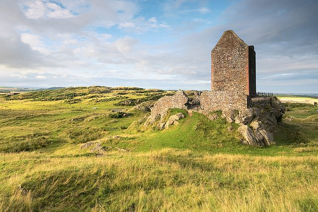

  
[Mostra un mapa més gran](http://maps.google.es/maps?f=d&hl=ca&geocode=&saddr=Blairgowrie&daddr=55.649699,-3.197021+to:Clintmains&mra=dpe&mrcr=0&mrsp=1&sz=8&via=1&doflg=ptm&sll=55.733296,-2.839966&sspn=1.518607,3.213501&ie=UTF8&ll=56.704506,-4.284668&spn=5.924981,12.854004&source=embed)

Día 11. Dejo el B&B de Rosebank House para viajar hacia el ecuador y entrar otra vez en el sur de Escocia, tierra de abadías. Al mediodía llego a [Edinburgh](http://es.wikipedia.org/wiki/Ciudad_de_Edimburgo), una de las ciudades más emblemáticas de Escocia. En estas fechas, Agosto, se está celebrando quizá el mejor festival de teatro del mundo, el [Edinburgh Internarnational Festival](http://www.eif.co.uk/). La verdad es que sin bajar del coche se ve mucho movimiento y me dieron muchas ganas de quedarme. Pero si una cosa debes hacer con este festival, es dejar de lado la improvisación, reservar un buen lugar para dormir un año antes, conocer las actuaciones y comprar las entrada con antelación y sobretodo no llevar coche. Es imposible dejar el coche en la ciudad, si no es que quieras aumentar las arcas del ayuntamiento con los parquímetros. Por estos motivos y tener la certeza que en un par de días no verás ni la décima parte de las cosas interesantes del festival decido pasar de largo.

La verdad es que tuve la sensación como si hubiera estado en [París](http://www.youtube.com/watch?v=uKlqoWchooY) y no [hubiera visitado la Torre Eiffel](http://images.google.es/images?q=Torre%20Eiffel&oe=utf-8&rls=org.mozilla:es-ES:official&client=firefox-a&um=1&ie=UTF-8&sa=N&hl=es&tab=wi), pero siempre queda la esperanza de volver. Me dirijo a [Melrose](http://en.wikipedia.org/wiki/Melrose,_Scotland), una bonita ciudad turística con una de las [abadías más importantes del país](http://en.wikipedia.org/wiki/Melrose_Abbey). Sabiendo que esta zona de Escocia es de las más visitada turísticamente, al comenzar la tarde empiezo y creyendo que iba con tiempo a buscar alojamiento en los pueblecitos principales en los alrededores de Melrose. No encontré nada razonable, y perdí prácticamente 4 horas cayendo la tarde encima mío. A escasos minutos de las 18:00 horas, me dirijo a la oficina de turismo para intentar  gestionar un alojamiento. El tema pinta mal, sobretodo para alojamiento barato y me tiro a la piscina y reservo un B&B de uns 60 £. Se llama el [Clint Lodge Conutry House](http://www.clintlodge.co.uk/), y me aseguran en la oficina que estará muy bien (menos mal…).Después de pasar la tarde volteando con coche, la verdad me apetecía parar y descansar y acepto.

El Clint Lodge está en Clintmains y es un gran caserón con 4 habitaciones dobles y una de individual. Lo lleva una pareja, Bill y Heather. La casa está muy decorada y tiene unas estancias nobles. El comedor con su gran mesa y muebles con una admirable cubertería, la sala de estar lleno de recuerdos familiares, una cocina tan grande como cualquier otra instancia de la casa y una terraza con una hermosa vidriera. Sencillamente, un lugar exquisito en el campo. Pero lo que más me llamó la atención fue el ambiente británico que se respiraba. La tele de la casa, sintonizando [carreras de caballos](http://www.youtube.com/watch?v=TiFdoEBhuqs) y en el parking iban llegando huéspedes con su [Land Rover](http://www.landrover.es/es/es/home.htm) y cañas de pescar. Era momento para agarrar mi [Renault](http://es.wikipedia.org/wiki/Renault_4) y cámara de fotos e ir a buscar algún momento lindo del atardecer.

<figure id="attachment_2201" aria-describedby="caption-attachment-2201" style="width: 630px"><figcaption id="caption-attachment-2201">Torre de Smailholm- Lluís Ribes i Portillo (<a href="http://creativecommons.org/licenses/by-nc-nd/3.0/" target="_blank" rel="noopener noreferrer">cc</a>)</figcaption></figure>

 Me dirigí a la [torre de Smailholm](http://www.discovertheborders.co.uk/places/5.html) que tiene unas vistas espectaculares de los campos de la región y por tanto unas fotos muy bonitas. Después de la visita a la torre, comencé a buscar una foto que tenía en mente desde el inicio del viaje de Escocia. El roble grande y noble en medio del campo. Di vueltas por los caminos asfaltados de la zona, me crucé con unos cuantos robles pero ninguno como al que finalmente fotografié:

<figure id="attachment_2121" aria-describedby="caption-attachment-2121" style="width: 630px"><figcaption id="caption-attachment-2121">Això és Escòcia – Lluís Ribes i Portillo (<a href="http://creativecommons.org/licenses/by-nc-nd/3.0/" target="_blank" rel="noopener noreferrer">cc</a>)</figcaption></figure>

fue una de esas fotos que cuando las ves en la pantalla de la cámara, inmediatamente te hace entender lo grande que es la fotografía, o lo pequeño que es el fotógrafo. Ya con el sol detrás del horizonte, me retiré al B&B y aproveché la WIFI instalada en el salón para navegar y hablar por Skype con mi gente. Buenas noches.

B&B  
  
Bill & Heather Walker  
Clint Lodge, St. Boswells, Melrose  
TD6 0DZ  
  
Tel: 01250872912  
Fax: 01835 822656  
mail: clintlodge@aol.com  
web: [http://www.clintlodge.co.uk/contact.html](http://www.clintlodge.co.uk/contact.html)  
Precio individual: 60 £