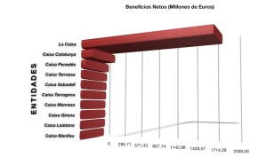

Me encantan las noticias de fusiones de las cajas catalanas de estos últimos dos meses:

-   [Las cajas catalanas quieren capear la crisis esquivando las posibles fusiones](http://www.gaceta.es/24-02-2009+cajas_catalanas_quieren_capear_crisis_esquivando_posibles_fusiones,noticia_1img,31,31,48407)
-   [Montilla augura fusiones entre las cajas catalanas](http://www.elpais.com/articulo/economia/Montilla/augura/fusiones/cajas/catalanas/elpepueco/20090520elpepueco_13/Tes)
-   [Montilla vaticina fusiones entre cajas catalanas](http://www.europapress.es/catalunya/noticia-montilla-vaticina-fusiones-cajas-catalanas-ganar-dimension-sobrevivir-20090520191500.html)
-   [Montilla confirma que habrá fusiones de cajas catalanas](http://www.expansion.com/2009/05/20/catalunya/1242851085.html)
-   [Montilla vaticina fusiones entre las cajas catalanas para poder ser más competitivas](http://www.abc.es/20090521/economia-banca/montilla-vaticina-fusiones-entre-20090521.html)
-   [Montilla prevé fusiones entre cajas de ahorro catalanas](http://www.lavanguardia.es/economia/noticias/20090520/53707213433/montilla-preve-fusiones-entre-cajas-de-ahorro-catalanas-generalitat-jose-montilla-barcelona-castilla.html)

¿Y quienes se fusionarán?. Ya veremos, suena una [“Caixa del Vallés” de la Terrassa, Sabadell y Manresa, otra fusión entre Caixa Catalunya y Caixa Tarragona](http://www.cotizalia.com/cache/2008/10/31/noticias_69_cataluna_esboza_posible_cajas_caixa.html) y mucho mas… Pero hay una que no aparece en las fusiones: La Caixa. En realidad La Caixa no necesita fusionarse. ¿Por qué? Os parece poco la siguiente gráfica que hace referencia a los beneficios netos de las diferentes cajas catalanas que he realizado a partir de los datos encontrados en la notica de [La Gaceta](http://www.lagaceta.es/):  
  
La Caixa, lo único que necesita es que en las diversas fusiones que se produzcan, el [Govern de la Generalitat](http://www.gencat.cat/) inyecte dinero para solventarlas y posteriormente cuando estén saneadas, La Caixa se las coma.  
Esta historia, seguro que se convertería en otro capítulo del libro [“Informe Sanuy, Defensa del petit comerç i crítica de ‘la Caixa'”](http://lluisr.blogspot.com/2006/07/informe-sanuy-defensa-del-petit-comer.html)

Nota: si alguien sabe donde puedo obtener más datos sobre un resumen de los beneficios de cada entidad financiera catalana, que deje un comentario