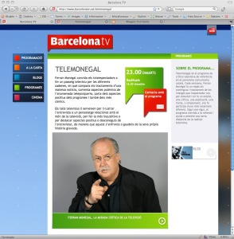

Poca tele veo, y que sea de forma regular, nada. Pero hay un programa de [BarcelonaTV](http://www.barcelonatv.cat/) que me fascinia: [Telemonegal](http://www.barcelonatv.cat/telemonegal). Es un programa que produce y presenta el periodista [Ferran Monegal](http://es.wikipedia.org/wiki/Ferran_Monegal) y realiza una crítica de la semana de los programas de tele.

Pues bien, me parece un programa excelente, muy inteligente, fresco y necesario. Se divide en dos partes fundamentalmente, una que es la recopilación de críticas (buenas y malas) y otra que es la entrevista. La primera parte es sensacional porque es un ejercicio de crítica elegante y lno repara en meter caña sobretodo a los programas que muchas veces haciéndonos creer que realizan un ejercicio de periodismo cubriendo una noticia de actualidad, lo único que hacen es revolcarse en el morbo. Y la segunda parte, que consiste en traer a un famoso relacionado con la televisión y entrevistarle sin dejar de pasar fragamentos televisivos donde participe y a la vez sea objetivo de una crítica. Claro está que esta parte es más interesante o no en función del invitado.  
Por ejemplo, en el último programa (16 de Junio 2009) ha tenido al director general de TVE, [Javier Pons](http://www.eleconomista.es/empresas-finanzas/noticias/143412/02/07/Javier-Pons-Un-creativo-entra-en-TVE.html), que tras darle un masaje el Monegal al principio de la entrevista diciéndole que ha conseguido llevar la TVE a ser los primeros en los rankings de audiencia, le preguntó sin complejos sobre temas peliagudos:

-   [El tema del himno nacional de la final de la Copa del Rey](http://www.rtve.es/deportes/20090514/los-silbidos-himno-final-copa-del-rey-dividen-los-politicos/276606.shtml)
-   El tema de [chiqkilicuatre](http://chikilicuatre.tumblr.com/), y como TVE promocionó un personaje que nació en un programa de una tele privada, la [Sexta](http://www.lasexta.com/inicio) y de una productora, [el Terrat](http://www.elterrat.com/), cuyo actual director de TVE y entrevistado fue director general
-   El tema de anuncios encubiertos en el programa “[España en Directo](http://www.rtve.es/programas/endirecto)” cuando hace escasas semanas despidieron al presentador [Manuel Torreiglesias](http://es.wikipedia.org/wiki/Manuel_Torreiglesias) por precisamente propaganda indirecta
-   Y la famosa entrevista de [Jose Maria García](http://es.wikipedia.org/wiki/Jos%C3%A9_Mar%C3%ADa_Garc%C3%ADa) censurada en el programa de “La noche de Quintero” hace más de dos años

Chapó, pero chapó también en este caso particular por Javier Pons por asistir a este programa, y sabiendo lo que le podía caer dio la cara. Excelente.

No todo en este país, no todo en la tele es mierda, hay joyas que creo que hay que dar a conocer. Y lo mejor, es que todos los programas de TeleMonegal [están disponibles en la web para verlos cuando quieras](http://www.barcelonatv.cat/alacarta/player.php?idProgVSD=5893). De hecho es lo que hago yo, cuando tengo un rato en casa, y tengo ganas conecto el ordenador y veo el programa de la semana. ¡Viva la televisión!  
PD: ¿para cuando un programa como este en una cadena nacional?