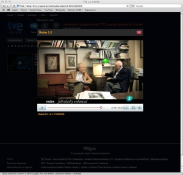

Nunca he leído un libro suyo, ni apenas he visto algún capítulo de su programa “[Redes](http://www.redes.tve.es/)“. [Pero viendo su trayectoria](http://es.wikipedia.org/wiki/Eduardo_Punset), escuchando como hablan de él personas a las que tengo una consideración especial y por los temas que trata me parece interesante comentaros que su programa “Redes”, ha cambiado de horario y se puede ver ahora los domingos a las 21h (y no a horas tempestivas de la madrugada como antes). Pero también, si se quiere desde Internet a través [del servicio a la carta de RTVE](http://www.rtve.es/alacarta):  
[  
http://www.rtve.es/alacarta/todos/abecedario/R.html](http://www.rtve.es/alacarta/todos/abecedario/R.html)

Intentaré seguirle