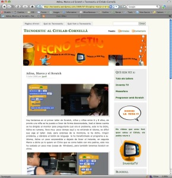

Me he topado con una entrada muy sencilla en un blog, aperentemente explica una anécdota en el campus de verano del [Citilab](http://www.citilab.eu/). Pero desde mi punto de vista, la entrada tiene una profundidad humana tremenda. Leerla, y a ver si os da la misma sensación:

[Adina, Marco y el Scratch](http://tecnoestiu.wordpress.com/2009/07/03/adina-marco-y-el-scratch/)
-------------------------------------------------------------------------------------------------

Un saludo a mis compañeros del centro, y en este caso sobretodo a Joan, quien nos ha dejado esta entrada tan bonita.