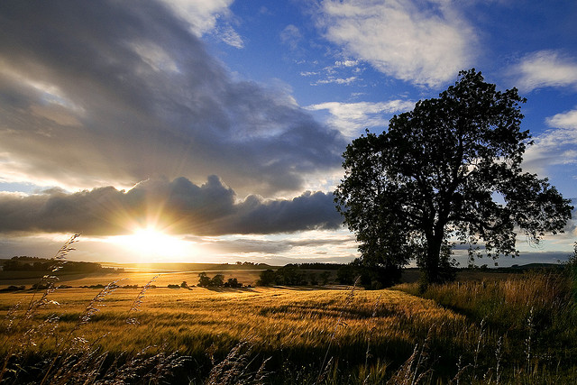
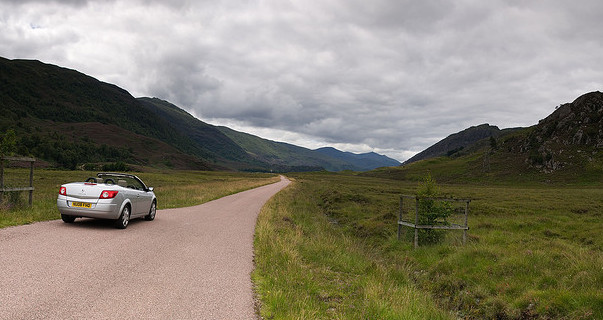

<figure id="attachment_2121" aria-describedby="caption-attachment-2121" style="width: 630px"><figcaption id="caption-attachment-2121">Això és Escòcia – Lluís Ribes i Portillo (<a href="http://creativecommons.org/licenses/by-nc-nd/3.0/" target="_blank" rel="noopener noreferrer">cc</a>)</figcaption></figure>

Ya doy por acabado mi resumen del viaje de Escocia. Ha pasado un año justo, y la verdad es que he estado más tiempo del que esperaba… Acabo de revisar los post, de poner links en el blog y os subo una última foto como testimoneo de mi viaje:  

<figure style="width: 290px"><figcaption>Lluís en el Faro de Dunnet</figcaption></figure>

  
Y ahora os dejo con toda la información útil del viaje que ya colgué meses atrás:  
He vuelto de un viaje a [Escocia](http://es.wikipedia.org/wiki/Escocia) que he realizado haciendo ruta por sus carreteras. Voy a realizar una serie de post del viaje que los dividiré en:

-   un primero, que es este, con la información más general del viaje
-   un post de cada día, con información de la ruta realizada, donde me alojé, fotos y comentarios varios.
-   un último post, que revisará este primero de la información del viaje

La idea del viaje ha sido recorrer Escocia con coche, desde el sur, subir por la costa oeste hasta llegar al punto más al Norte de la isla del reino unido, para volver a bajar por su costa este. Todo ello en Agosto, en unos 13 días y aproximadamente realizando unos 2500 kilómetros.

Escocia es un territorio con una geografía muy variada: playas de arena blanca, costa de acantilados, montañas escarpadas, prados verdes ondulados, estepa, así como una cantidad increíble de islas. Un territorio muy interesante para recorrer en coche y para practicar la fotografía de paisajes, otro de mis alicientes del viaje. Pero a parte de la preciosidad de su territorio, Escocia está llena de historia y lugares interesante aunque quizá en este viaje no he aprovechado tanto este lado más cultural.

El viaje lo comienzo con sólo tres reservas realizadas: el avión, el coche, y la primera noche.  
El avión  
Volé de [Barcelona](http://es.wikipedia.org/wiki/Barcelona) a [Newcastle](http://es.wikipedia.org/wiki/Newcastle) (en realidad el nombre completo es Newcastle Upon Tyne) con [EasyJet](http://www.easyjet.com/). Con EasyJet pude comprar los billetes de forma rápida y sencilla, y el vuelo fué muy bien.  
El coche de alquiler  
Para el coche, lo alquilé en la web de [Thrifty](http://www.thrifty.com/) especificando el alquiler que fuera en la oficina de Newscastle, a donde volaba. Es de los mejores servicios que he recibido. Pedí un descapotable de clase media, estilo [Peugeout 307 cc](http://en.wikipedia.org/wiki/Peugeot_307_CC). y tras realizar la reserva por Internet y recibir la confirmación, pasado unos días recibí un mail indicándome que al tratarse de una oficina que está a 10 km del aeropuerto me venían a buscar sin cargo alguno. Y así fué, me estaba esperando un “driver” cuando el vuelo aterrizó, que me llevó a las oficinas en 15 minutos. Algo parecido pasó a la vuelta, les pedí si me podían llevar a la [estación de tren](http://en.wikipedia.org/wiki/Newcastle_Central_railway_station) (dado que la vuelta de todo el viaje la realicé por Londres) que estaba en el centro de Newcastle y me llevaron sin ningún problema. Tambíen fué un acierto por parte de ellos que sabiendo las millas que iba a hacer aproximadamente me dejaran un modelo diesel. Sencillamente muy bien.  
El coche no tenía GPS, pero no hacía falta. Compré los mapas de la [Ordinance Survey](http://www.ordnancesurvey.co.uk/oswebsite/) para planificar rutas regionales con una escala 1:250 000 que correspondían a Escocia ([Road 1](http://leisure.ordnancesurvey.co.uk/leisure/ItemDetails.jsp?item=os_road_1) y [Road 3](http://leisure.ordnancesurvey.co.uk/leisure/ItemDetails.jsp?item=os_road_3)) y fué imposible perderse fuera de los grandes nucleos urbanos… Estos mapas de pueden comprar en cualquier oficina de turismo. Las carreteras en Escocia están muy bien. A pesar de que no hay grandes autopistas y hay muchas carreteras de un solo carril con un espacio cada 200 metros para ceder el paso, están bien mantenidas y muy bien señalizadas. A excepción de las carreteras principales en el este y en el sur, el tráfico es muy bajo. Perfecto para disfrutarlas con coche, o moto.

<figure id="attachment_2122" aria-describedby="caption-attachment-2122" style="width: 593px"><figcaption id="caption-attachment-2122">En los valles de los Highlands – Lluís Ribes i Portillo (<a href="http://creativecommons.org/licenses/by-nc-nd/3.0/" target="_blank" rel="noopener noreferrer">cc</a>)</figcaption></figure>

En cuanto la gasolina, os comento que el diesel, que era el que usaba, era caro: entre el chollo del 1,21pp en una gasolinera de una ciudad a 1,4pp en muchas gasolineras en lugares lejos del las urbes del sur. Ahora, en España el diesel está a 1,28 pero €.  
La primera noche, y las siguientes…  
Como os he comentado la primera noche la tenía reservada, en un [Bed&Breakfast (B&B)](http://en.wikipedia.org/wiki/Bed_and_breakfast). Todo el viaje iría durmiendo en un principio en B&B. Los B&B son alojamientos que ofrecen una habitación y un desayuno. Hay de muchas clases, de más sencillos y baratos (20pp) hasta de más lujosos (70pp), casi como un hotel. La diferencia con un hotel, entiendo yo, es que el alojamiento se sitúa en la misma casa, como una [casa rural](http://es.wikipedia.org/wiki/Casa_rural) aquí en España. Los B&B son una gran oportunidad para entrar en contacto con la gente local, muy gentiles en general, ya que muchas veces acabas desayunando en la misma cocina de la casa con otras personas.  
En los post de cada día os hablo con más detalle de cada uno de ellos pero en general me quedo con los siguientes puntos de los B&B, aplicables al mes de Agosto:

-   Los B&B que aparecen en las guías están ya ocupados y es imposible encontrar uno el mismo día a un precio bueno. Este punto es aplicable sobretodo en temporada alta, Agosto. Pero no os preocupéis, hay miles de B&B en Escocia
-   Los B&B que una oficina de turismo en una población te puede encontrar el mismo día o son cero o son cero, igual que pasa con el punto anterior.
-   Los mejores B&B, para mi, son aquellos que se sitúan en lugares fuera del circuito turístico. Es decir, en carreteras a algunos kilómetros de los pueblos turísticos o en pueblos que no tienen ningún interés turístico en especial. Es fácil encontrar lugar el mismo día, son más familiares, baratos y auténticos.
-   Si vas solo, hay algunos B&B que no te admiten sobretodo si estás en un lugar muy turístico dado que tienen habitaciones dobles. A pesar de ello, puedes pedir por pagar un poco más por la habitación doble, te pueden hacer un precio interesante a pesar de todo.
-   Aprovecha la hospitalidad y por las mañanas entabla conversación con el hostelero así como con el resto de gente que puedan estar desayunando contigo, puedes obtener información muy valiosa de la zona. Pero sobretodo porque comenzarás el día con muy buen rollo.

Durante el viaje, el 80% de los alojamientos fueron B&B y el resto hoteles. También es recomendable ir a [Youth Hostels](http://www.hihostels.com/), porque hay muchos o a campings. Esta última opción es muy atractiva en verano pero hay que tener en cuenta [los mosquitos](http://en.wikipedia.org/wiki/Midge), que en gran parte del país es una gran molestia y el tiempo, que en Agosto es bueno en general pero a pesar de ello impredicible…

En cuanto a guías, me llevé la [Lonely Planet](http://www.lonelyplanet.com/) de [Escocia](http://www.geoplaneta.com/Guias_Viaje_Escocia_2_EXT412554.html). Imprescindible para tener una visión general del país y para encontrar lugares muy interesantes. Pero lo mejor era complementar la guía con aquellas recomendaciones que los dueños de los B&B o gente que iba conociendo por el viaje me daban. Descubrí lugares excelentes que no estaban en la guía.Bueno, he creado ya los post de los 12 días:

[Día 12 – Escocia](http://lluisr.blogspot.com/2008/08/da-12-escocia.html)  
[Día 11 – Escocia](http://lluisr.blogspot.com/2008/08/da-11-escocia.html)  
[Día 10 – Escocia](http://lluisr.blogspot.com/2009/04/dia-10-escocia.html)  
[Día 9 – Escocia](http://lluisr.blogspot.com/2008/08/da-8-escocia.html)  
[Día 8 – Escocia](http://lluisr.blogspot.com/2008/08/dia-8-escocia.html)  
[Día 7 – Escocia](http://lluisr.blogspot.com/2008/08/da-7-escocia.html)  
[Día 6 – Escocia](http://lluisr.blogspot.com/2008/08/da-6-escocia.html)  
[Día 5 – Escocia](http://lluisr.blogspot.com/2008/08/da-5-escocia.html)  
[Día 4 – Escocia](http://lluisr.blogspot.com/2008/08/da-4-escocia.html)  
[Día 3 – Escocia](http://lluisr.blogspot.com/2008/08/da-3-escocia.html)  
[Día 2 – Escocia](http://lluisr.blogspot.com/2008/08/da-2-escocia.html)  
[Día 1 – Escocia  
](http://lluisr.blogspot.com/2008/08/mostra-un-mapa-ms-gran.html)