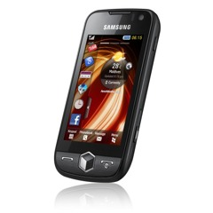

Buenos días!,

acabo de publicar unos pequeños cambios estéticos en el blog. Los cambios vienen condicionados para visualizar sin problemas el blog en dispositivos móviles. De momento se han aplicado dos cambios que se aplicarán a partir de ahora en los nuevos post:

-   Disminución del peso de la página: se pasa de una media de 600Kb a 200Kb por la carga de la página inicial, disminuyendo el tiempo de carga y más importante, dismunyendo la memoria usada del móvil para visualizarla. ¿Cómo se ha conseguido? Limitando el número de posts visibles a los tres últimos (alguna vez he escrito más de 3 post en una semana… 🙂 ), disminuyendo el tamaño de las imágenes, eliminando widgets no imprescindibles

-   Visualización de videos youtube de forma directa: para poderlos visualizar si no tienes Adobe Flash instalado, o tienes una versión antigua. ¿Cómo se ha conseguido? si ponéis un enlace de video sustituyendo “www.” por “m.”,entraréis en la versión móbil del mismo video. Veréis que hay un link “Wath video” que es un link tipo “[rtsp](http://es.wikipedia.org/wiki/RTSP)“. Al hacer click abre vuestro reproductor del móvil y ejecutará el video en streaming sin usar Flash. Vaya, a mi me solucionado la visualización con mi móvil…

Por otra parte, la intención es que el blog pueda también visualizarse correctamente en una pantalla de ordenador en un rincón, pero sin ocupar la totalidad de la pantalla: que este blog no es tan importante!