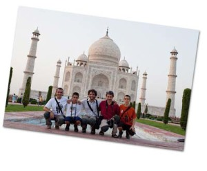

Y aquí los 5 del viaje de la India delante del majestuoso e impresionante Taj Mahal. La foto nos los hizo una chica de Madrid que iba en un grupo de cuatro que al pasa dos días en la India de la meseta central decidieron marchar al sur del país con avión hacia las playas paradisiacas de [Goa](http://en.wikipedia.org/wiki/Goa).  
Otra India bien diferente, o no…