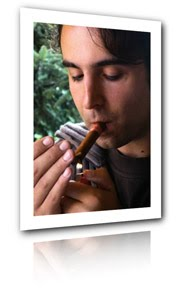

Mi hermana me hizo esta excelente foto en una comida mientras encendía un puro. Inmortalizo ese momento en mi blog con una cita de [Platón](http://es.wikipedia.org/wiki/Plat%C3%B3n):

“El comienzo es la parte más importante de un trabajo”

377-B / Libro I / La República