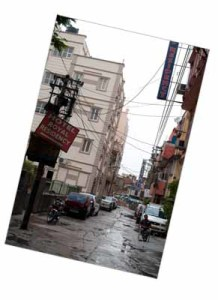
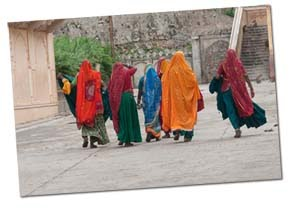
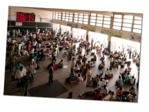

Este post del viaje a la India lo voy a dedicar a exponer unas reflexiones tras los 15 días de vacaciones que pasé en ella.

[Como os comenté en el anterior post de la India](http://lluisr.blogspot.com/2009/09/india-2009-detalles-del-viaje.html), identificamos como mínimo tres indias diferentes en ese mismo país:

-   La inmensa India pobre
-   La terrible India mísera
-   La pequeña India emergente

(1) La inmensa India pobre  
La inmensa India pobre es aquella por la que nos movimos en la totalidad del viaje. Es una India sin excesos ni lujos, muy caótica pero ordenada a la vez y donde la gente vive con mucha dignidad y poca cosa. A pesar de esta dignidad la cultura de la limpieza sorprende por ser muy escasa. Las calles están muy sucias, la basura crece en cualquier rincón, los animales como las vacas, perros y monos (e iba a decir los elefantes, pero estaría exagerand) campan a sus anchas, los sistemas de clavaguera prácticamente no existen y ver a gente hacer las necesidades en la calle no es extraño ni polémico. Y esto, pasa tanto en los ambientes rurales, como en las grandes urbes donde los efectos se multiplican por la concentración de gente. Como curiosidad, esta dejadez higiénica no quita que que para muchos indios es un ritual bañarse y limpiarse los dientes cada mañana.  
Esta India es profundamente religiosa. Indús y musulmanes en su mayoría comparten con sijs, y budistas y cristianos en menor medida la comunidad todo ello sin conflictos aparentes entre ellos. El ritmo de vida está marcado por la religión y el trabajo que marcan un ritmo de vida cotidiano, tranquilo y constante donde da la sensación que el tiempo se para y no da lugar a cambios. Este estilo de vida tan poco dinámico ha moldeado gente más calmada, sencilla y atenta con el extraño aunque sin perder ni pizca la curiosidad y el ingenio que llevan en su interior.  
Esta paralización social es palpable en muchos otros ámbitos. Por ejemplo en las mujeres. En general las mujeres en la India tienen un carácter reservado y muy poco emprendedor. No nos engañemos, no será por falta de facultades, cuando veías un grupo de niños y niñas estas llevaban muchas veces la iniciativa. La sociedad les dirige su energía hacia objetivos muy concretos. Vi muchas mujeres trabajando y trabajadoras, pero me costó mucho verlas al frente de un comercio, trabajando de cara al cliente. Quizá en alguna tienda ambulante de verduras o frutas, pero poco más. Entrabas en un comercio y te atendía un hombre y si había una mujer estaba trabajando siempre en segundo plano. Y no solo en el trabajo palpabas esta diferenciación entre los sexos. Me sorprendió ver como en una gasolinera se paraba un tractor lleno de personas, los hombres iban a los servicios (bastante sencillos) y el grupo de mujeres se dirigían detrás de un pequeño montículo a mear. Y detalles como estos a montones. Podían ser más frecuentes estas situaciones en la regiones rurales, pero en general, estas situaciones las veías fijándote un poco en todas partes.  
Lo más curioso de todo ello es que la constitución de la India establece los mismos derechos a hombres y mujeres y hay personalidades femeninas muy importantes de referencia en la India como por ejemplo la astronauta [Kalpana Chawla](http://es.wikipedia.org/wiki/Kalpana_Chawla) o la jefa del gobierno de Uttar Pradesh (una de las regiones més importantes) [Mayawati Kumari.](http://en.wikipedia.org/wiki/Mayawati)  
En realidad este tema es muy complejo y lo estaré tratando con mucho superficialidad. Así pues, si queréis más información podéis comenzar viendo este documental de 45 minutos: [La mujer en la India](http://www.youtube.com/watch?v=n9-2Oop9KnA)  
En cuanto a las castas pude observar un par de detalles. Uno ,ver como los policias (por cierto, muy amables con los turistas y sinceramente es de agradecer), que tradicionalmente han pertenecido a la casta [kshatrias](http://adaniel.tripod.com/origin.htm) son los únicos indios altos que hay en todo el pais. Vaya que aquí [Gregor Mendel](http://es.wikipedia.org/wiki/Gregor_Mendel) tendría mucho demostrado de sus teorías sobre la herencia genética. Otro detalle lo encontramos en uno de los pueblos que visitamos. Al comenzar a entablar conversación con los habitantes conocimos a un hombre de una casta específica capaz de mandar a dedo al resto del pueblo que le hicieran recados al momento, o que decía tener 10 novias a sus disposición en su móvil (y me lo creo creo). Aunque el tema de las castas para mi quedó bastante oculto, dos detalles que os he expuesto seguro que pueden ser la punta del iceberg.  
Y así es esta India, que si le despojas de los avances técnicos puedes tener la sensación de estar siglos atrás, pero a día de hoy es un cocktail agridulce: miles de millones de personas, que conviven en urbes y en el campo de la misma forma, en una comunidad caótica pero aparentemente ordenada, multicultural pero aparentemente respetuosa, pobre pero aparentemente feliz, trabajadora pero aparentemente relajada, justa pero aparentemente injusta. Y sin duda hay que experimentarlo.

(2) La pequeña India emergente

La segunda India que categorizamos, solo tuvimos tiempo de experimentarla en las últimas horas del viaje, cuando antes de dirigirnos al aeropuerto estuvimos en una ciudad cerca de Delhi, Gurgaon, realizando las últimas compras. Todo se veía más limpio, los carriles de las carreteras tenían un sentido y los vehículos no transportaban el doble de personas por las que están diseñados a transportar. No habían animales en las autopistas y el centro comercial donde hicimos una parada estaba muy limpio, era moderno con tiendas de marca, y ojo, precios que en algunos artículos muy inferiores a los precios que podías encontrar en mercados o bazares en los lugares turísticos. En esta ciudad se levantaban rascacielos de las multinacionales y una cierta organización occidental y bien, tan solo estando dos horas comenzamos a entender un poco en que consistía aquello que llaman la nueva superpotencia de la India. Sin duda, si solo visitas esta India, que por otra parte no parecía muy grande, puedes salir con una sensación eufórica del país creer que la India va a ser el nuevo páis referente. Pero dudo que no acarree los mismo problemas de base que la inmensa India pobre.  
(3) La terrible India mísera  
Y por último la tercera India, que no se visitó pero conocedores de su existencia la expongo y es aquella donde la marginilidad y la pobreza es extrema, barrios donde pocos osan entrar, barrios levantados sobre vertederos, lugares donde hay mafias de niños para usarlos en la mendicidad o la prostitución. Os dejo un ejemplo, el barrio rojo de Bombay, Kamathipura. Podéis ver más [información en la wiki](http://en.wikipedia.org/wiki/Kamathipura) y [un reportage en esta web](http://www.pbs.org/frontlineworld/stories/india304/index.html) (20 minutos). Y es que esto también es la India y no podemos perder nuestra vista en la singular primera India ni en la potencia económica de la segunda India.