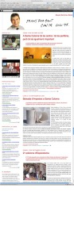

… el monstruo de las galletas fue abatido. [En mi anterior artículo](http://lluisr.blogspot.com/2009/10/google-el-monstruo-de-las-galletas.html), exponía el contrasentido que apareció en el [blog del alcalde de Santa Coloma, Bartolomeu Muñoz](http://bartomeu.blogspot.com/), (detenido en una operación anticorrupción juntamente con más personalidades de la política del oasis catalán) al mezclarse los artículos varios que escribía sobre su ciudad y las noticias del día que el plug-in o complemento de [google noticias](http://news.google.es/) instalado en su blog emitía, noticias sobre su detención, su posible distitución, su implicación en la trama.

Y este google noticias era mi monstruo de las galletas, pero hoy, el blog ha aparecido sin él, así como todos los demás plug-ins de noticias (netvives, noticias socialistes), y hasta sin los comentarios de los lectores que se escribían desde el 2006 (!). [(Aquí podéis bajar una captura del blog aun con las noticias del google horas después de la detención del alcalde)](http://farm3.static.flickr.com/2496/4056051221_3bee97ecb7_o.jpg)  
No me ha sorprendido, y hasta puedo entenderlo. Al fin al cabo, el blog sirve a su amo y señor y no debía ser muy político tener todas esas noticias incrustradas salpicando el blog. Pero por Dios, ¿qué gracia tiene ahora? ¿El leer los artículos que en su día un alcalde o su gabinete de prensa creaban bajo su antojo e intereses?¿Y los comentarios, todos ellos previos al escándalo, que tenían de malo?  
El blog es un espacio vivo, que evoluciona, que guarda conocimiento, experiencias y que le debe a sus lectores un respeto. Por lo menos, si se desactivan las noticias y los comentarios, pueden tener un detalle con los lectores del blog y explicar los motivos de tal decisión (aunque sean obvios). Pero bueno, cada uno en su casa hace lo que quiere.  
Aprovechando el tema de la semana, me ha gustado el inicio del artículo de opinión de [Francesc de Carreras](http://es.wikipedia.org/wiki/Francesc_de_Carreras_Serra) en [La Vanguardia](http://www.lavanguardia.es/) de hoy:

> “\[…\] el ex presidente Jordi Pujol declaraba a TV3, en referencia de la corrupción política, que no le parecía conveniente “tirar de la manta” porque “todos” saldríamos perdiendo \[…\]. ¿Es cierto que si de una vez tiramos de la manta saldremos “todos” perdiendo? Si este “todos” se refiere a los ciudadanos, al contrario: ha llegado el momento de ir aclarando las cosas \[…\]”
> 
> ¡Pues sí, tiremos de la manta!