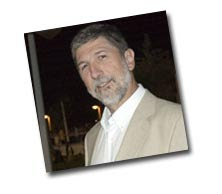

Dos nuevas incorporaciones en los links “blogs de amigos”

[TIC en Sanidad y Educación](http://blogs.sun.com/eloy)La primera, es el blog de “TIC en Sanidad y Educación” de Eloy Rodriguez. Eloy le conocí años atrás en un proyecto nacional de puesta en marcha de una red de [computación Grid](http://en.wikipedia.org/wiki/Grid_computing) de investigación. En este proyecto participaba universidades y centros de investigación y una empresa privada, [SUN Microsystem](http://www.sun.com/) de la cual Eloy pertenece como director del desarrollo de negocio area pública de sanidad y educación.  
Hace poco le he vuelto a encontrar la pista y he descubierto que tiene este blog sobre TIC en las organizaciones públicas españolas . Lo escribe desde su puesto de manager en SUN, por tanto está claro que es un blog con aires coorporativos de su emprea, ¡obvio! pero no deja de ser muy interesante para conocer las últimas tendencias en temas TIC en el sector público español y nuevos productos de [Oracle](http://www.blogger.com/www.oracle.com) y [SUN](http://www.sun.com/) escritos desde la proximidad de un blog. Un blog muy profesional, y actualizado cada día prácticamente.  
[Distribuïnt…](http://distribuint.blogspot.com/)  
El segundo blog, es de un amigo del antiguo grupo de investigación [GridCAT](http://www.gridcat.org/), Marc de Palol, que hasta hace poco sabía que escribía en un blog muy personal y anárquico llamado [devavalot](http://devavalot.blogspot.com/). Pero paralelamente, parece ser que de tanto en tanto escribe en otro blog fruto de su gran conocimiento como ingeniero especializado en sistemas distribuidos y que ha demostrado con su paso de forma sobrada por [GridCAT](http://www.gridcat.org/) (;) ), por el [Barcelona Supercomputer Center](http://www.bsc.es/) y actualmente en [Lastfm](http://www.lastfm.es/home), donde trabaja en Londres. Este blog, llamado [Distribuint…](http://distribuint.blogspot.com/), escribe sobre conceptos avanzados de programación de una forma muy clara. Buena escritura y sana dedicación a una profesión que queda reflejado en este blog.