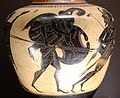
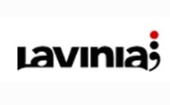
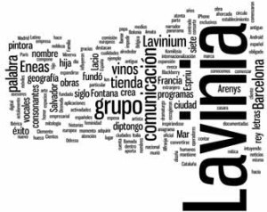

¿ Qué es Lavinia ?

Lavinia es una palabra de 7 letras, 4 vocales, 3 consonantes y 1 diptongo. Pero Lavinia es también una palabra que ha retenido historias como las que os voy a contar…

Según cuenta la mitología romana, [Lavinia](http://es.wikipedia.org/wiki/Lavinia) era la hija del rey [Latino](http://es.wikipedia.org/wiki/Latino_%28mitolog%C3%ADa%29), rey del pueblo más antiguo de Italia, y de [Amata](http://es.wikipedia.org/wiki/Amata), reina del consorte de la región de Lacio quien murió ahorcada ante su hija al no poder impedir que se casara con un extranjero, el troyano [Eneas](http://es.wikipedia.org/wiki/Eneas).  
De la relación entre Lavinia y Eneas surgió una ciudad llamada [Lavinium](http://es.wikipedia.org/wiki/Lavinium) quien Eneas fundó en honor a su esposa. Lavinium fue una ciudad en la actual provincia de [Lacio.](http://es.wikipedia.org/wiki/Lacio)  
Cientos de años más tarde, en el siglo XVI a 300 km de la antigua Lavinium, en Bolonia, una pintora retratista se hacía un hueco entre el círculo de pintores más prestiogiosos. Hasta el punto de convertirse en artista oficial del papa Clemente VIII. El nombre de esta pintora, como estaréis intuyendo era [Lavinia](http://es.wikipedia.org/wiki/Lavinia_Fontana), [Lavinia Fontana](http://es.wikipedia.org/wiki/Lavinia_Fontana).  
[Lavinia Fontana](http://es.wikipedia.org/wiki/Lavinia_Fontana) tiene alrededor de 100 obras documentadas donde destacan los retratos y obras religiosas como por ejemplo la [Minerva Desnuda](http://pintoresfamosos.juegofanatico.cl/artista/images/fontana/minerva.jpg) o la [Sagrada Familia](http://pintoresfamosos.juegofanatico.cl/artista/images/fontana/familia_juan.jpg).  
[Lavinia](http://es.wikipedia.org/wiki/Lavinia_Fontana) me evoca feminidad, nobleza, arte y quizá estas cualidades fueron las que en su día influyeron en nuestro poeta, dramaturgo y narrador del siglo XX [Salvador Espriu](http://es.wikipedia.org/wiki/Salvador_Espriu) en llamar a [Barcelona](http://www.bcn.cat/) como [Lavinia](http://www.bcn.cat/) dentro de su particular geografía mítica. Esta geografía la compone otros nombres como Alfranja (Cataluña), Komilòsia (España), Sephard (Península Ibérica) y Sinera, un anagrama de [Arenys de Mar.](http://www.arenysdemar.org/)  
Precisamente un grupo de personas de [Arenys de Mar](http://www.arenysdemar.org/) comenzaron en 1994 un nuevo grupo empresarial centrado en la comunicación digital. Este grupo, fundado en [Barcelona](http://www.bcn.cat/) e inspirándose en la obra de [Salvador Espriu](http://es.wikipedia.org/wiki/Salvador_Espriu) escogieron la marca de [Lavinia](http://www.lavinia.tc/) como representante de sus activadades  
El grupo [Lavinia](http://www.lavinia.tc/) ha trabajado siempre para los principales operadores, productores y medios de comunicación españoles y recientemente europeos. Produce películas y programas de televisión, aporta los recursos humanos y técnicos a redacciones de noticias de comunicación nacional, programas de éxito en el panorama español, o a la misma comisión europea, diseña crea y mantiene páginas web y crea aplicaciones para móviles como [iPhone](http://www.apple.com/es/iphone/) o con plataformas [Android](http://www.android.com/) y [Blackberry](http://worldwide.blackberry.com/). Todo para comunicar.  
La internacionalización del grupo [Lavinia](http://www.blogger.com/www.lavinia.tc) les ha obligado a comenzar a expandirse, de momento a Bélgica, y a Francia…  
…Francia, tierra de vinos como los que venden la tienda [Lavinia](http://www.lavinia.com/).  
Porque [Lavinia](http://www.lavinia.com/) es también el nombre de una tienda de vinos que Thierry Serveant fundó en 1999 con su primer establecimiento en [Madrid](http://www.madrid.es/). Un lugar donde adquirir vinos priorizando la comunicación entre el cliente y el producto gracias a la atenta atención personalizada de los asesores en tienda. El éxito de la empresa es visible con la expansión a los espacios más exclusivos de las ciudades de [Barcelona](http://www.bcn.cat/), [París](http://es.parisinfo.com/), [Ginebra](http://www.ge.ch/) o [Odesa](http://es.wikipedia.org/wiki/Odesa).  
Y con una copa de vino en mano finalizo este pequeño artículo…  
¿ Qué es Lavinia ?  
Lavinia es una palabra de 7 letras, 4 vocales, 3 consonantes y 1 diptongo

http://www.wordle.net/show/wrdl/1339269/Lavinia

  
Referencias  
[http://pintoresfamosos.juegofanatico.cl/artista/fontana.htm](http://pintoresfamosos.juegofanatico.cl/artista/fontana.htm)  
[http://hlte.wordpress.com/2008/05/09/lavinia-fontana-1552-1614/](http://hlte.wordpress.com/2008/05/09/lavinia-fontana-1552-1614/)  
[http://www.lavinia.tc](http://www.lavinia.tc/)  
[http://www.finanzzas.com/lavinia-producira-la-tv-de-la-comision-europea](http://www.finanzzas.com/lavinia-producira-la-tv-de-la-comision-europea)  
[http://www.lavinia.com](http://www.lavinia.com/)  
[http://www.lavinia.fr/LaviniaFR/pdf/EL\_PAIS\_Octubre2009.pdf](http://www.lavinia.fr/LaviniaFR/pdf/EL_PAIS_Octubre2009.pdf)  
[http://es.wikipedia.org/wiki/Lavinia](http://es.wikipedia.org/wiki/Lavinia)  
[http://es.wikipedia.org/wiki/Salvador\_Espriu](http://es.wikipedia.org/wiki/Salvador_Espriu)