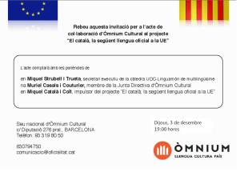

Os paso/informo de una invitación para todos aquellos que quieran asistir a un acto de colaboración con el proyecto “El català, la següent llengua oficial a la UE” donde habrán tres interesantes ponencias. Estas ponencias expondrán los diferentes trabajos e iniciativas existentes para conseguir que el [catalán](http://es.wikipedia.org/wiki/Idioma_catal%C3%A1n) sea reconocido como lengua oficial de la UE.

Jueves, 3 de diciembre  
19:00 horas

Sede nacional de Òmnium Cultural  
c/Diputació 276 pral. BARCELONA  
Teléfono: 93 319 80 50

De las tres ponencias, destaco la de [Miquel Català](http://www.akamc2.cat/bloc/) un amigo del ex-grupo de investigación de [Gridcat](http://www.gridcat.org/). Miquel, hace un año atrás saltó a primera línea de los medios de comunicación porque realizó la versión en catalán de las páginas web del [Europarlamento](http://www.europarl.europa.eu/) y las colgó en [Europarl.cat.](http://www.europarl.cat/) La reacción del Parlamento Europeo intentó ser tajante y eliminar esta versión en catalán, pero ante la imposibilidad de hacerlo legalmente y la postura constructiva y positiva de Miquel, la web sigue en marcha a día de hoy.

Es más, Miquel comenzó otra web para apoyar la oficilialidad del catalán en la UE:

  
[http://www.oficialitat.cat/](http://www.oficialitat.cat/)

En esta web podéis firmar a favor de este propósito y seguir toda la información al respecto.