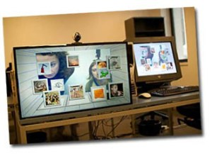
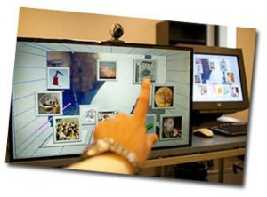
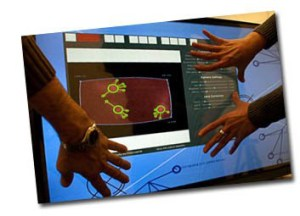

La semana pasada, [Óscar Ardaiz](http://beyondaround.wordpress.com/about/) de la [Universidad Pública de Navarra](http://www.unavarra.es/) me invitó a probar un prototipo de interficie que había desarrollado en unos meses en la [Universidad Pompeu Fabra](http://www.upf.edu/). Era una interficie colaborativa donde dos personas podían interectuar mediante una pantalla táctil, una videoconferencia y un escritorio 3d. Para probarlo, dos personas tenían que crear unas historias conjuntamente con una fotografias que aparecían en el entorno virtual.

El sistema se basa en una pantalla donde detrás de ella hay una cámara capaz de detectar la posición de los dedos sobre la misma pantalla y de esta forma el programa procesar las órdenes del usuario. Con los dedos, podías mover las imágenes en los tres ejes X,Y y Z. Podéis ver en la siguiente imágen como el programa “ve” los dedos:

