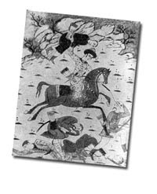
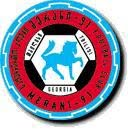
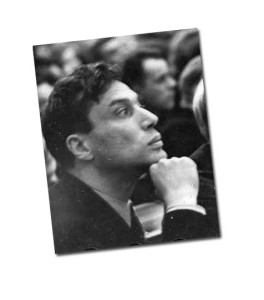
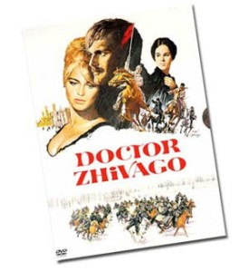
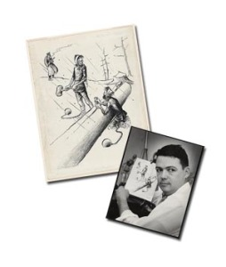

  

[El último artículo escrito en este blog era un poema ruso: Merani](http://lluisr.blogspot.com/2010/02/merani.html). Merani es un apodo que reciben los caballos en [Georgia](http://es.wikipedia.org/wiki/Georgia), un pais que había pertenecido a la antigua unión soviética. Podemos encontrar referencias de este apodo por ejemplo en el escudo del modesto club de fútbol de tercera división de la ciudad de Georgia de [Tbilisi](http://es.wikipedia.org/wiki/Tiflis): el [FC Merani Tbilisi.](http://en.wikipedia.org/wiki/FC_Merani_Tbilisi) En su escudo un corcel azul dibuja una figura poderosa y noble con mucha fuerza.

Con la misma fuerza que el poeta Boris Pasternak escribía los versos de nuestro poema Merani, a principios del siglo XX, y al que le dedico un pequeño espacio aquí para que lo conozcáis un poco más.

¿Quién era?

Boris Pasternak fue un autor ruso que nació el 10 de Febrero de 1890, en [Peredélkino](peredelkinohttp://www.peredelkino-land.ru), cerca de Moscú. Fue poeta y novelista de una obra no muy extensa pero dicen que exquisita y sin duda reconocida hasta el punto que fue premio [Nobel de Literatura en](http://es.wikipedia.org/wiki/Premio_Nobel_de_Literatura) 1958 (por cierto, [¿sabéis por qué no hay Nobel de Matemáticas…?](http://intrinsecoyespectorante.blogspot.com/2009/08/por-que-no-hay-premio-nobel-de.html) )

Nació en una familia cosmopolita, su padre era un [famoso pintor judío](http://es.wikipedia.org/wiki/Leonid_Pasternak) y su madre una concertista de piano reconocida, que le permitió moverse en círculos de amistades de grandes artistas de la época.  
Su obra

La gran mayoría de su obra literaria, principalmente fue poética y la elaboró entre 1913 y 1934 . Quedó muy interrumpida en la década de los treinta por la [Gran Purga](http://es.wikipedia.org/wiki/Gran_Purga) soviética, una persecución del estado hacia políticos, militares y artistas en general a los cuales se les consideraban traidores. Estos eran vigilados, retenidos, encarcelados y hasta ejecutados.en muchas ocasiones. Boris Pasternak, no se escapó de la purga aunque pudo evitar los campos de concentración rusos, [los temidos Gulag](http://es.wikipedia.org/wiki/Gulag). Así pues, dejó aparcada su creación literaria y su trabajo se centró en traducir obras alemanas e inglesas al ruso (tradujo una gran cantidad de obras de [Shakeaspeare](http://es.wikipedia.org/wiki/William_Shakespeare))

Esta dedicación a las traducciones no evitó que el pueblo ruso le acabara reconociendo ya no solo por sus poemas sino por la importancia de su gran trabajo como traductor , y tampoco evitó que alrededor de los años 50 acabara de escribir su obra más famosa, una novela: “[Doctor Zhivago](http://es.wikipedia.org/wiki/Doctor_Zhivago)“.

Doctor Zhivago, [de la que se basó una película con el mismo nombre ganadora de 5 óscars,](http://www.imdb.com/title/tt0059113/) narra la historia de un hombre dividido entre el amor de dos mujeres en una época de fuerte transformación de la sociedad con la revolución soviética y la posterior guerra civil. Doctor Zhivago le valió el premio Nobel de Literatura en 1958 a pesar que no fue publicada con toda normalidad en la unión soviética hasta 1988 . Y es que esta no pasaba la censura soviética. Habían muchas referencias de las injusticias sociales del sistema soviético así como de los campos de concentración.

Entonces, antes que fuera olvidada o eliminada por el aparato del partido, cuando finalizó el manoscrito fue sacada clandestinamente la obra de su pais para su divulgación fuera de la URSS. Hay dos versiones de cómo se hizo.

Una primera versión es que la CIA y el MI16 se enteraron que el manuscrito de la novela estaría en cierto avión, cierto día de 1958. Desviaron el avión hacia Malta, lo detuvieron allí, y fotografiaron hoja por hoja el manuscrito durante dos horas, para luego devolverlo sin que nadie se diera cuenta. De aquí hicieron un libro que serviría para hacer copias y enviarlo a la [Academia Sueca](http://es.wikipedia.org/wiki/Academia_Sueca) (quien elige cada año el ganador del Nobel de Literatura).

La segunda versión, es que su amigo Isaiah Berlin lo sacó clandestinamente e hizo una versión en italiano en 1957, editada por Feltrinelli, que se transformó en éxito de ventas; siendo traducida y publicada en varios países no soviéticos.

El Nobel  
En cualquiera de los casos, Boris Pasternak ganó el Nobel de Literatura, pero la historia continuaba…  
Tras ganar el premio, envió el siguiente telegrama de agradecimiento a la Academia:

“Estoy inmensamente agradecido, conmovido, orgulloso, asombrado, aturdido”

Al momento, no tardó a aparecer una campaña en contra del poeta en la URSS acusándole de traidor, judas y enemigo del pais. Las amenazas llegaron a tal extremo que se realizaban a veces pequeñas manifestaciones en frente de la [Soviet Union of Writers](http://en.wikipedia.org/wiki/USSR_Union_of_Writers) – de la que él era miembro y que tuvo dejarlo de ser – donde se gritaban acusaciones contra Boris Pasternak . A todo ello su amada fue amonestada y presionada varias veces en su trabajo. Eso llevó al poeta, el 28 de octubre de 1958 a enviar un segundo telegrama a la academia, donde rechazaba el premio. Decía:

“Considerando el significado que este premio ha tomado en la sociedad a la que pertenezco, debo rechazar este premio inmerecido que se me ha concedido. Por favor, no tomen esto a mal”.

En 1960, Boris Pasternak murió, su obra Doctor Zhivago no aparecería en su país hasta pasado 28 años y finalmente su hijo el 9 de Diciembre de 1989 recogió la medalla a título póstumo del Nobel de Literatura de su padre.

Otro premio

Una curiosidad, saltamos de premio a premio, del Nobel al [Pulitzer](http://www.pulitzer.org/), porque como anécdota, el dibujante [Bill Mauldin](http://en.wikipedia.org/wiki/Bill_Mauldin) ganó el Pulitzer en el año 1959 con una dibujo satírico donde se representa a Boris Pasternak en un campo de concentración junto a otro preso diciendo: “Yo gané el Nobel de literatura, ¿cuál fue tu crimen?”.  
Si queréis más…  
Para finalizar, si algún día viajáis a Moscú, tenéis tiempo y ganas de acercaros a la obra de este poeta, podéis visitar su pueblo natal Peredélkino a unos 40 minutos en coche de la capital. Allá, [se puede visitar su casa, que es ahora un museo](http://www.museum.ru/M449). Una preciosa casa roja con su habitación grande pero vacía de ornemantación y muebles, apenas con su escritorio y una gran cantidad de libros.  
Peredélkino es un pequeño lugar de perigración también, dado que el escritor es querido en su tierra. Como muestra, podéis leer este artículo de 1984 d El País de [Pilar Bonet](http://www.elpais.com/internacional/corresponsales/corresponsal.html?corId=11): [Los rusos conmemoran la muerte del poeta disidente Boris Pasternak](http://www.elpais.com/articulo/cultura/PASTERNAK/_BORiS/UNIoN_SOVIeTICA/rusos/conmemoran/muerte/poeta/disidente/Boris/Pasternak/elpepicul/19840531elpepicul_9/Tes/)  
Referencias  
  

-   [A Tale of two telegrams](http://www.sovlit.com/twotelegrams/)
-   [Poets: Boris Pasternak](http://www.poets.org/poet.php/prmPID/364)
-   [WikiPedia](http://es.wikipedia.org/wiki/Bor%C3%ADs_Pasternak)
-   [El Arca de Sofía: “Definición de la labor creadora”, Boris Pasternak](http://arcadesofia.blogspot.com/2008/03/definicin-de-la-labor-creadora-boris.html)
-   [La labor del intelectual y los premios Nobel de Literatura: Sartre, Pasternak y Günter Grass](http://www.rebelion.org/noticia.php?id=44330)
-   [Forum](http://www.batumionline.net/forums/index.php?showtopic=730)
-   [Web de Peredélkino](http://www.peredelkino-land.ru/)
-   [Museo de Boris Pasternak](http://www.museum.ru/M449)
-   [Poemas de Boris Pasternak (ruso)](http://pasternak.niv.ru/)
-   [Doce poetas rusos](http://www.poeticas.com.ar/Antologias/Doce_poetas_rusos/frame.html)
-   [Bill Mauldin Beyond Willie and Joe](http://www.loc.gov/rr/print/swann/mauldin/mauldin-intro.html)