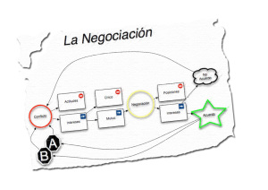

Esta última semana hemos trabajado la negociación Harvard en clase con Rufino. Os dejo un pequeño esquema que he realizado sobre consideraciones básicas a tener en cuenta antes y en el transcurso de una negociación, sin entrar en el tiempo de negociación. Podéis pinchar la imagen para ver la chuleta en grande:

Os explicaré la primera consideración, porque es muy aplicable a la vida cotidiana y se resume en: las actitudes NO se negocian, tan solo se negocian los Intereses. Si esto no lo acabáis de entender, por lo menos tened fe en ello.

PD: las actitudes se trabajan, se moldean, pero no se negocian…