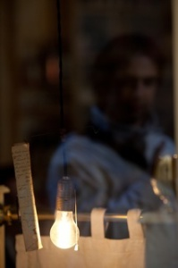

Hola,

como sé que algunos de vosotros estáis esperando un resumen de las jornadas de [Pepe Baeza](http://www.nikonistas.com/digital/viewer.php?IDN=847) a las que asistí sobre los portales en Internet de fotoperiodismo, y no voy a poder acabar el artículo como mínimo hasta el próximo fin de semana (ei, lo he comenzado 🙂 ), os dejo unos enlaces para que comencéis a chafardear.

Portales de fotoperiodismo profesionales:

-   [MediaStorm](http://www.mediastorm.org/) (Washington Post)
-   [Lens](http://lens.blogs.nytimes.com/) (New York Times)
-   [The Big Picture](http://www.boston.com/bigpicture/) (Boston Post)

Portales de fotoperiodismo amateurs:

-   [7.7](http://7punt7.net/)
-   [Demotix](http://www.demotix.com/)

Resumen de las jornadas por el fotógrafo [Paco Elvira](http://www.pacoelvira.com/)

-   [10 Reflexiones de Pepe Baeza](http://www.pacoelvira.com/2010/02/10-reflexiones-de-pepe-baeza-sobre.html)
-   [Kevin Carter y el respeto a la dignidad](http://www.pacoelvira.com/2010/02/kevin-carter-y-el-respeto-la-dignidad.html)

Una aportación mia complementaria. Un listado con una gran cantidad de enlaces a portales de fotoperiodismo:

-   [The best photography blogs and photojournalism blogs – Zoriah.net](http://www.zoriah.net/blog/2009/12/the-best-photography-blogs-and-photojournalism-blogs.html)

  
(La foto de la bombilla es de [Jordi Vilas](http://www.flickr.com/photos/jordivilas/))