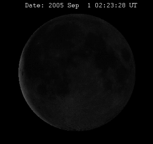

Hoy hay luna llena, y mirándola me pregunto ¿Por qué vemos siempre la misma cara de la Luna? Mi teoría, torpe, siempre ha sido que la luna no tiene rotación. Bueno, no hagáis caso. Siempre vemos la misma cara porque la combinación de su eje de rotación con su trayectoría alrededor de la tierra produce este efecto.Concretamente, sacado de la [wikipedia](http://es.wikipedia.org/wiki/Luna):

“La Luna gira sobre un eje de rotación que tiene una inclinación de 88,3º con respecto al plano de la elíptica de traslación alrededor de la Tierra. Dado que la duración de los dos movimientos es la misma, la Luna presenta a la Tierra constantemente el mismo hemisferio.”

