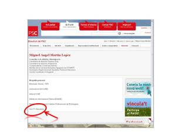

Hola,

ayer leí en [La Vanguardia Digital](http://www.lavanguardia.es/) un noticia que muchos de vosotros habréis leído tambíen:

[Un cargo del PSC de Barcelona califica a Terribas de mal follada](http://www.lavanguardia.es/politica/noticias/20100317/53897698110/un-cargo-del-psc-de-barcelona-califica-a-terribas-de-mal-follada.html)

De la noticia solo comentar que si este cargo del [PSC](http://www.psc.es/), Miguel Angel Martin, supiera lo que se ha tenido que currar esta señora en su vida profesional y sobretodo personal quizá no dormiría con la consciencia tranquila tras estas declaraciones “públicas” (creo que usó Facebook para anunciar sus palabras).  
Bueno, pero a lo que iba en este artículo, investigando quién es Miguel Angel Martin visito la web del PSC, le busco en el buscador de personas y sorpresa simpática en su biografía personal.  
Miguel Angel Martín es:  
– Licenciado en Derecho (UAB)

– Abogado ICAB

– Máster en Administración Pública (ESADE)

– Miembro de la Asociación Catalana Profesional de Estranjería

(de momento, una biografía -o curriculum- interesante, no?) y por último….

– Socio del FC Barcelona (!)

Es que no puede faltar en un resumen tan escueto de la biografía de una persona, el club de fútbol de tus amores. Ahora entiendo el porque antes de ayer, [tras el cuarto gol de Boyan contra el Sttugart](http://www.youtube.com/watch?v=eUGYa99fyVU) todo el [Camp Nou](http://es.wikipedia.org/wiki/Camp_Nou) gritaba:

“oh oh oh, eh eh eh, ser del Barça és, lo millor que hi ha”

Os dejo una captura de pantalla para que veáis que curioso me ha parecido (pichar con el ratón para verlo en grande):  
