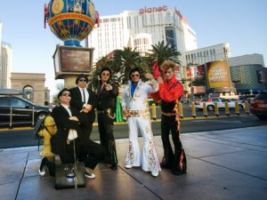

Arriba una foto de algunos artistas de la calles. Los Elvis tenían mucho éxito, Elwood y Jack tenían su gracia y eran buenos y David Bowie no se comía ni un rosco, parecía una estatua humana pero era simpático. Solo hay un lugar donde puedas reunirlos a todos juntos: Las Vegas…

… Bye bye Las Vegas,  me dirigo al oeste no sin antes parar a tomar un café con leche en una especie de vaso de poliestireno expandido (espero que no lo sea) y una tarta de chocolate en un horno de una entrañable pareja de personas mayores en el super VONS, 1131 E. Tropicana Road (cerca de las Vegas Strip si vas en carro).