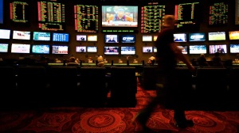

Primer día en Las Vegas – y último -. Algunos de vosotros ya lo sabréis, otros lo sabréis ahora. Estoy una semana en EEUU donde realizaré un taller de fotografía en Death Valley (California).

Aprovechando que tengo que volar hasta Las Vegas, me quedo un par noches. No tengo muchas cosas a decir respecto de este lugar a parte de todo aquello que podáis encontrar en los blogs de viajes que hablan de esta “peculiar” ciudad. Por tanto, de momento no cuento nada nuevo.

Sí deciros que hoy hago una cena atípica seguramente aquí. Aprovechando la cocina que tengo en mi habitación me cocino unos sandwichs de queso emmental y pavo mientras me bebo una pinta de cerveza japonesa Kirin, todo ello con el canal de música de los años 80 sonando en el equipo multimedia. Atípica porque a mis pies, bajo unas cuantos pisos la gente estará degustando las cocinas más exquisitas de los chefs con más reputación del mundo, bebiendo vinos y champange de sobrada solera y todo ello armonizado con música en vivo auténtica.

¿Qué, a que soy radical? Pues no, porque aquí en Las Vegas, al final, todos nos juntaremos en la misma mesa, la del casino…

Mañana, un par de fotos a primera hora y partimos al desierto.