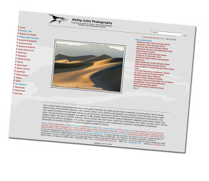

A raíz del viaje a California a Death Valley y Lone Pine he descubierto dos fotógrafos muy interesantes.

[Peter Lik](http://en.wikipedia.org/wiki/Peter_Lik) ([www.peterlik.com](http://www.peterlik.com/)): un alucinado, una especie de [Crocodrile Dundee](http://www.youtube.com/watch?v=01NHcTM5IA4) (de hecho es australiano) pero de la fotografía de paisaje, sobretodo de EEUU. Pero la verdad es que la envidia me corroe…y le admiro, ha sabido hacer de sus fotografías obras de arte y todo una parafernalia comercial alrededor de estas muy interesante. Tiene varias galerías por todo el mundo, una de ellas y que os recomiendo que visitéis si estáis en Las Vegas es la situada en el casino [The Venetian](http://www.venetian.com/).

  
Phillip Colla ([www.oceanlight.com](http://www.oceanlight.com/)): un fotógrafo americano de naturaleza con una web con más de 20,000 fotografías (!). Todas las fotos están catalogadas, documentadas, geocalizadas y muchas de ellas se pueden comprar on-line y te las envían a casa. Es una gran web tanto de foto, como de naturaleza y un excelente lugar para los estudiantes.

