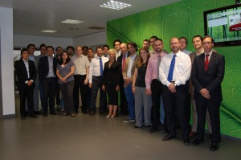

La semana pasada he estado completamente out. Primero, con la entrega y la finalización del [PostGrado de Dirección de Sistemas de Información](http://www.talent.upc.edu/professionals/presentacio/codi/31068700/direccion/sistemas/informacion) en la UPC School. Por cierto, la siguiente foto estamos gran parte de los compañeros entre estudiantes y profesores del curso:

  
Acabado el postgrado, volé a Málaga para dirigirme a la provincia de Cádiz donde disfrutar de unos días de playa en lugares sensacionales:

Bueno, de ambas cosas hablaré más adelante con detalle, de momento volvemos a Barcelona.