<figure id="attachment_2396" aria-describedby="caption-attachment-2396" style="width: 1014px"><a href="http://www.lluisribes.net/wp-content/uploads/2010/07/4747228724_a6fd8f4439_b.jpg">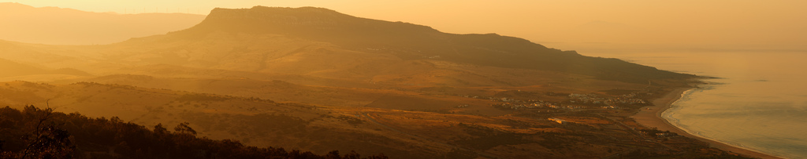</a><figcaption id="caption-attachment-2396">Amanecer en Bolonia – <a href="http://creativecommons.org/licenses/by-nc-nd/3.0/">Lluís Ribes i Portillo (cc)</a></figcaption></figure>

Para Sant Joan estuve en Bolonia en la [provincia de Cádiz](http://es.wikipedia.org/wiki/Provincia_de_C%C3%A1diz) cuatro días y os dejo en ests post un mini resumen. Como ya sabéis algunos, teniamos un taller de fotografia con [Alberto Alix-Garcia](http://es.wikipedia.org/wiki/Alberto_Garc%C3%ADa-Alix) en [Bolonia](http://es.wikipedia.org/wiki/Playa_de_Bolonia) pero se canceló pero no así el viaje que decidí hacerlo.

Bolonia es una de las playas que están en los más de 100 Km de costa entre Tarifa y Cádiz. Más concretamente se situa a 13 km al este de Tarifa. Es una playa, técnicamente una [ensenada](http://es.wikipedia.org/wiki/Ensenada), de 3km de longitud bañada ya por aguas atlánticas con un horizonte dominado en días claros por la costa africana. Tan solo hay un pequeña urbanización llamada el Lentiscal que viene a ser un conjunto de casitas que se situan alrededor de la única calle que recorre la playa.  
Ya os podéis estar imaginando este lugar como es, la verdad es que es muy tranquilo, fuera de las hordas de turistas y sin niguna construcción de chalets y apartamentos que tanto florecen en el resto de la costa española. Es un lujo y que se mantengan así para mucho tiempo.

<figure id="attachment_2398" aria-describedby="caption-attachment-2398" style="width: 1014px"><a href="http://www.lluisribes.net/wp-content/uploads/2010/07/4743644614_404ba9f053_b.jpg">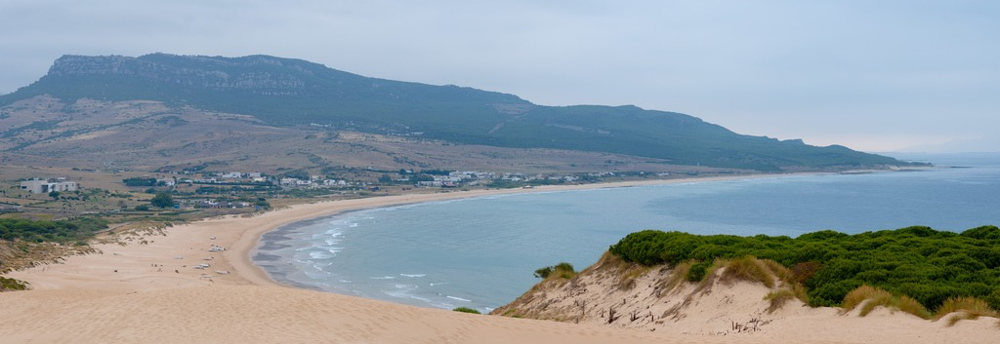</a><figcaption id="caption-attachment-2398">Playa de Bolonia – <a href="http://creativecommons.org/licenses/by-nc-nd/3.0/">Lluís Ribes i Portillo (cc)</a></figcaption></figure>

La playa es bonita ideal para tomar el sol o caminar en ella en las mañanas o las tardes mientras la marea llena de reflejos la arena. No busquéis una playa con ambiente, gente para conocer y salir de fiesta y calles llenas de locales para comer para comprar y servicios varios o apartamentos cómodos etc, olvidaros de todo esto.

<figure id="attachment_2399" aria-describedby="caption-attachment-2399" style="width: 630px"><a href="http://www.lluisribes.net/wp-content/uploads/2010/07/4743499350_acc6e53931_z.jpg">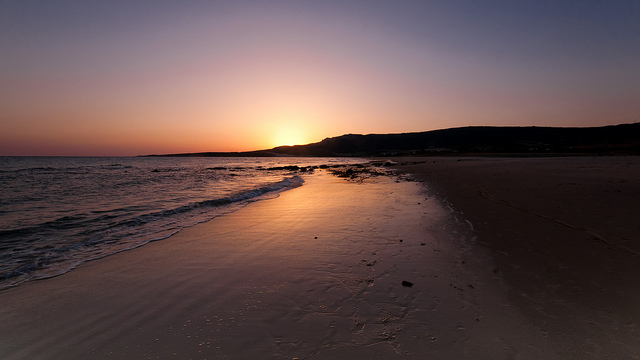</a><figcaption id="caption-attachment-2399">Atardecer en Bolonia – <a href="http://creativecommons.org/licenses/by-nc-nd/3.0/">Lluís Ribes i Portillo (cc)</a></figcaption></figure>

¿Cómo llegar?  
Para llegar la mejor solución es con transporte privado dado que apenas llega un pequeño bus y para moverse un poco por la zona vas a necesitar coche.  
Si vienes desde lejos, más allá de las tierras andaluzas, tienes varios aeropuertos. Uno de ellos es el de [Jerez de la Frontera](http://www.aena.es/csee/Satellite?pagename=Estandar%2FPage%2FAeropuerto&MO=0&SMO=-1&SiteName=XRY&c=Page&cid=1048519503361), a 80 km. de Bolonia. Pero mejor el de [Málaga](http://es.wikipedia.org/wiki/Aeropuerto_de_M%C3%A1laga) a 120 Km o el de Sevilla a 150km porque estos dos tienen una frecuencia de vuelos muy grande y podrás encontrar vuelos a todas horas y todos los días. En mi caso volé de Barcelona a Málaga con [Iberia](http://www.iberia.es/) (aunque actualmente opera Vueling) ya que hay cuatro o cinco vuelos cada día. Salí a las 07:15 horas de tal forma que a las 09:00 estaba saliendo del aeropuerto de Málaga para poder llegar a las 10:30 a Bolonia.  
También puedes viajar a Málaga o a Sevilla con el [AVE](http://www.renfe.es/) desde Madrid.  
Una vez que se llega a una de las capitales anteriores lo suyo es alquilar un coche y bajar dirección Algeciras para llegar a la N340 donde encontraremos un desvío hacia Bolonia a 13 km de Tarifa. En Málaga la oferta de coches de alquiler es muy grande y si vienes en avión, en la planta inferior se situan una decena de compañías diferentes de alquiler.

  
[Ver mapa más grande](http://maps.google.es/maps?f=d&source=embed&saddr=M%C3%A1laga&daddr=Bolonia,+Tarifa&hl=es&geocode=&mra=ls&sll=36.719646,-4.420019&sspn=0.690184,0.807495&g=malaga&ie=UTF8&ll=36.368222,-5.075684&spn=5.306996,6.591797&z=6)

¿Dónde dormir?  
En Bolonia hay varios hostales y se puede alquilar apartamentos. Son difíciles de encontrar por Internet. Pero yo os voy a recomendar uno, que es donde estuve y se llama “La Posada de Lola”.  
[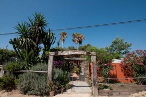](http://www.lluisribes.net/wp-content/uploads/2010/07/Lola-Entrada.jpg)  
[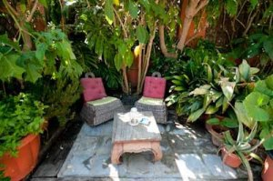](http://www.lluisribes.net/wp-content/uploads/2010/07/Lola-ChillOut-2.jpg)“La Posada de Lola” está en el Lentiscal, la pequeña urbanización de la playa de Bolonia, comentada y es un hostal que lo lleva la misma Lola una mujer con mucha gracia y muy atenta con la gente que se hospeda. Es una casa de color naranja rosado de tres pisos con unas habitaciones sencillas pero muy limpias, con la posibilidad de tener baño propio. [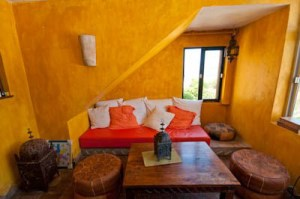](http://www.lluisribes.net/wp-content/uploads/2010/07/Hostal-Lola-Sala-de-estar.jpg)A todo ello tiene una pequeña sala fresca y muy agradable en la primera planta y tiene un patio con tres o cuatro zonas chill-out con sofás, mesitas con velas unas antorchas y mosquiteras para relajarse a la noche con buena compañía. La posada no está en primera linea de mar, pero tan solo estás a 5 minutos caminando para poder extender el pareo en las arenas de la playa de Bolonia.  
[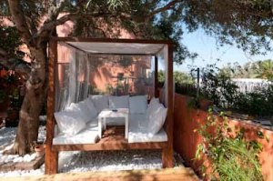](http://www.lluisribes.net/wp-content/uploads/2010/07/Lola-ChillOut-3.jpg)Encontrar La Posada de la Lola la primera vez no es muy fácil. Cuando llegas en coche continua por la calle que va paralela a la costa, pasarás un pequeño puente y a 50 metros hay una entrada a mano izquierda a una pequeña esplanada de tierra. Entras y al fondo a la izquierda verás un parking con unas cubiertas. Ese es el parking de la posada y la entrada está delante del parquing.  
[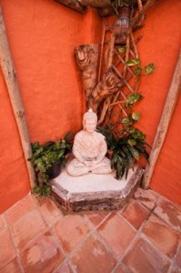](http://www.lluisribes.net/wp-content/uploads/2010/07/Hostal-Lola-Buda.jpg)El precio de la noche en temporada alta es alrededor de 60 € la habitación doble. No es barato y los días que estaba no ofrecían desayuno pero no por ello voy a dejar de recomendaros este hostal tan acogedor.

La posada de Lola  
c/ el lentiscal nº 26 bolonia,  
Tarifa, Cádiz.  
Tel: 956 68 85 36  
web: [www.hostallola.com](http://www.hostallola.com/)

¿Qué hacer?  
Yo me compré un pequeña guía que es buena pincelada de las opciones turísticas de la provincia de Cádiz. La guía es [“Guiarama Cádiz y Gibraltar” de la serie Touring Club, ANAYA](http://www.anayatouring.com/) no es que le hiciera mucho caso pero siempre le saqué alguna idea 🙂 :  
Descansar. ¿Quieres pedir algo más? 🙂 Es un lugar ideal sin agobios y con toda una playa para disfrutar.  
[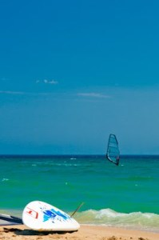](http://www.lluisribes.net/wp-content/uploads/2010/07/Windsurf-Valdevaqueros.jpg)Windsurf. La playa de Bolonia no es de las famosas para hacer windsurf de la zona porque los vientos no siempre son tan buenos como en otras playas cercanas. Pero sigue siendo una buena opción, con buen viento tienes toda una ensanada a tu disposición y algún chiringuito donde podrás encontrar material. Y a malas puedes dirigirte al [Spin-Out de Valdevaqueros](http://www.tarifaspinout.com/) a 15 minutos en coche donde encontrarás todas las instalaciones necesarias para hacer windsurf durante todo un día y los mejores vientos de toda la península.  
[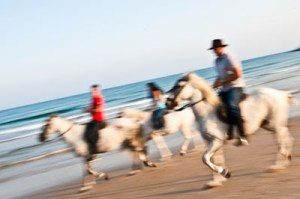](http://www.lluisribes.net/wp-content/uploads/2010/07/Caballos-en-Bolonia.jpg)Equitación, escalada, bicicleta, trekking… todo y más a la orden del día. Hay muchas empresas que organizan salidas deportivas diversas por toda la zona.  
[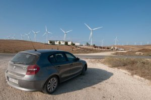](http://www.lluisribes.net/wp-content/uploads/2010/07/BMW-en-la-Zarzuela.jpg)Visitar la provincia de Cádiz. En realidad esa fue mi intención cuando nos anularon el taller de fotografía… pero hay tantos lugares y experiencias que lo dejé estar y me quedé en Bolonia descansando. Os enumero algunas excursiones de un día a realizar desde Bolonia: las ciudades de Cádiz y Jerez, el pueblo de Sanlúcar de Barrameda y las coperativas de manzanilla, los pueblos blancos como Vejer de la Frontera Medina Sodina o Alcalá de los Azules, los parques naturales del interior donde se situan villas hermosas entre abundante flora y montaña como Ubrique o la pintoresca Grazalema, los carnavales de Cádiz,…  
Cruzar el estrecho, desde Tarifa puedes ir en ferry a Tánger y estar unos días en Marruecos en apenas dos horas.  
Dos recomendaciones culinarias  
Si queréis un capricho, dirigiros a [Zahara de los Atunes](http://es.wikipedia.org/wiki/Zahara_de_los_Atunes), a 30 minutos en coche de Bolonia. De este pueblecito turístico de costa sale una carretera hacia la urbanización de Atlanterra. En el kilómetro 1, a mano derecha hay un restaurante hotel llamado Antonio. Restaurante de corte clásico y cocina andaluza podréis tomar una de las joyas de la zona como es el atún rojo con un servicio de mesa excelente. El plato estrella (en todos los sentidos…) es el Morrillo de Atún que es servido en dos filetes vuelta vuelta y con sal gorda… :-q”’

Antonio  
Carretera de Atlanterra, km 1  
Zahara de los Atunes  
Tel: 956 439 141  
Web: [www.antoniohoteles.com](http://www.antoniohoteles.com/)

Otra recomendación para cenar es el restaurante Souk, en Tarifa. Es un restaurante de cocina marroquí, moderno y precio correcto con una zona con terraza para tomar un té a la noche muy interesante. Está a la entrada de Tarifa, fuera del núcleo urbano.

Souk  
Mar Tirreno 46  
Tarifa  
Tel: 956 62 70 65  
web: [www.souk-tarifa.es](http://www.souk-tarifa.es/)

Resumen  
Si buscas un pequeño paraiso, un lugar donde pasar los días sin que pasen Bolonia te encantará.