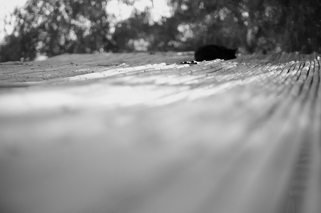

<figure id="attachment_1984" aria-describedby="caption-attachment-1984" style="width: 630px"><figcaption id="caption-attachment-1984">Lluís Ribes (cc)</figcaption></figure>

> “Ser artista es: no calcular, no contar, sino madurar como el árbol que no apremia su savia, mas permanece tranquilo y confiado bajo las tormentas de la primavera, sin temor a que tras ella tal vez nunca pueda llegar otro verano. A pesar de todo, el verano llega.”

[“Cartas a un Joven Poeta”](http://es.wikipedia.org/wiki/Cartas_a_un_joven_poeta)  
[Rainer María Rilke](http://es.wikipedia.org/wiki/Rainer_Maria_Rilke)  
  
(gracias a [Matías](http://matiascosta.blogspot.com/) por la recopilación de textos especiales en su taller)