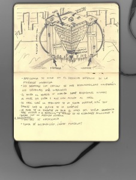

Un edificio que tengo en mente desde hace tiempo. Una pirámide invertida donde el despacho de presidencia está en la punta de la pirámide invertida, abajo de todo para que el presidente tenga la sensación de estar soportando toda la empresa sobre sus espaldas. ¿Qué responsabilidad, eh?  
Lo he dibujado hoy mientras comía una [ensalada césar](http://es.wikipedia.org/wiki/Ensalada_C%C3%83%C2%A9sar) en el Foster’s Hollywood ( a veces me aburro …):

A continuación los puntos que describo en la segunda página:

-   Presidencia se situa en el despacho inferior de la pirámide invertida
-   Cuanto más responsabilidad tenga un cargo, más abajo se situará su despacho
-   El acceso al edificio se realiza mediante unos ascensores en el nivel del suelo que suben hasta el hall situado en la planta superior.
-   La planta superior, toda ella en su totalidad, es el hall
-   La punta de la pirámide invertida no toca el suelo. Por tanto todos deben entrar a través de los ascensor por el hall. Inclusive presidencia o dirección que para acceder a sus despachos deberán usar los ascensores, subir al hall y con unos ascensores interiores bajar a su s despachos.

Temas a solucionar:

-   Salidas de emergencia
-   Planta de restauración. ¿Dónde colocarla?
-   Desagües. No me lo quiero imaginar.

  
(Actualización 13/08/2010)

A raíz de los comentarios del artículo, añado información de dos edificios con un diseño de pirámide invertida.

-   El primero es el Pabellón de China de la Expo de Shanghai. Se llama la “Corona de Oriente” y está diseñado por el arquitecto [He Jingtang](http://en.wikipedia.org/wiki/He_Jingtang). Más información: [http://www.plataformaarquitectura.cl/2009/09/15/pabellon-de-china-expo-shaghai-2010/](http://www.plataformaarquitectura.cl/2009/09/15/pabellon-de-china-expo-shaghai-2010/)
-   El segundo edifcio es la sede central de [COPISA](http://www.copisa.com/) en Barcelona, reciéntemente estrenado en el nuevo barrio singular de Hospitalet. Diseñado por [Oscar Tusquets](http://es.wikipedia.org/wiki/%C3%93scar_Tusquets). Más información: [http://www.copisa.com/es-es/galeria-de-proyectos/obras-destacadas/obras-destacadas/edificio-corporativo-copisa.html](http://www.copisa.com/es-es/galeria-de-proyectos/obras-destacadas/obras-destacadas/edificio-corporativo-copisa.html)