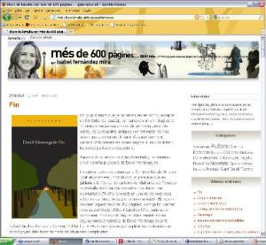
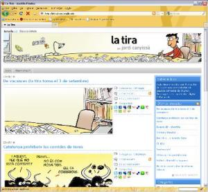

Actualizo mi blogroll de amigos con dos blogs de compañeros del trabajo.

El primer blog es de Isábel Fernández. Ella es una devoradora de libros y de ello escribe en su bloc [“Més de 600 pàgines… quin totxo oi?”](http://blocs.lamalla.cat/bloc/isabelfernandez). Bueno, no sobre como devorarlos precisamente, sino que escribe opiniones de libros que ha leído y reflexiones del mundo editorial en general. En su momento aporté mi granito al bloc con el artículo “[Krytos i secrets](http://blocs.lamalla.cat/bloc/isabelfernandez/post/kryptos_i_secrets)” cuando le presté “Los códigos secretos” uno de mis libros preferidos 🙂  
El segundo blog el de Jordi Canyissá y se llama “[La tira](http://latira.blocs.lamalla.cat/) “. Es un blog donde publica una tira cómica semanal alrededor de la actualidad. Humor sin complicaciones ni pretensiones, sencillo y limpio y aunque con un marcado punto de vista particular poco a poco yo lo voy encontrando más interesante.  
