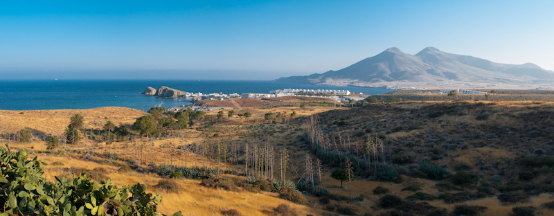
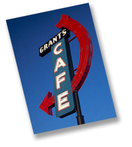
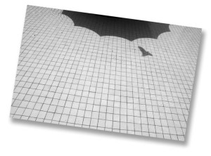

<figure id="attachment_1987" aria-describedby="caption-attachment-1987" style="width: 790px"><figcaption id="caption-attachment-1987">Lluís Ribes i Portillo (cc)</figcaption></figure>

Hace un mes que volví del Cabo de Gata donde asistí a los talleres de Óscar Molina. Más concretamente al que asistí fue al de Matías Costa bajo el nombre de Cuaderno de Campo.En este taller entre muchas cosas, de las mejores es conocer a gente y a la vez poder disfrutar de sus trabajos. Os voy voy a dejar a continuación una recopilación de enlaces con información de algunos de los compañeros del taller.Conchi MartínezDesde hace varios años, Conchi compagina su trabajo como profesora con su pasión a la fotografia. Es su web, [www.conchimartinez.com](http://www.conchimartinez.com/), podemos ver que esta pasión ha dado como fruto interesantes proyectos.  
De los proyectos personales destacaría el que nos enseñó de [“Hortus Botanicos”](http://www.conchimartinez.com/autor/hortus/index.html) donde fusiona partes del cuerpo humanos con plantas. Este proyecto impreso es de mucha calidad y fue muy interesante verlo en las láminas en que nos lo presentó. A los que les gusta viajar, su sección de [Fotografía Documental](http://www.conchimartinez.com/documental/chicago/Chica_IMG_1272.html) recoge fotos de algunos de sus viajes, que no son pocos y con un resultado estupendo .  
Concha Ortega  
En la web [www.conchaortega.com](http://www.conchaortega.com/) encontramos un punto de encuentro de la obra de Cocha: sus proyectos fotográficos e información de contacto.  
El proyecto que nos presentó en los talleres, [“La grieta del tiempo”](http://www.conchaortega.com/index.php?/proyectos/la-grieta-del-tiempo/) lo podéis encontrar en la web y es un proyecto que transcurre alrededor de los últimos años de una señora anciana. En el proyecto se combinan retratos de la señora, espacios cotidianos de ella así como fotografías antiguas. Ver “La grieta del tiempo” desde la primera foto a la última es como entrar en un sueño agridulce.  
Otro de los proyectos que encontramos en su web, [“Tarde de toros”](http://www.conchaortega.com/index.php?/proyectos/tarde-de-toros-/), pese tener una serie de fotos muy pequeña (unas 7) tiene algunas fotos de toros de mucha belleza. Las fotos 2,3,4,5 y 6 me encantan.  
Victoria Miñana  
Victoria nos presenta en su web [www.victoria-fotografia.com](http://www.victoria-fotografia.com/) sus proyectos profesionales y en [www.behance.net/victoriaminana](http://www.behance.net/victoriaminana) los proyectos más artísticos. Su dedicación al mundo de la imagen es muy alta. Profesionalmente se centra en el sector de la arquitectura y moda trabajando tanto con foto como en video.

En su web artística se pueden observar varios trabajos en la sección Projects destacando el proyecto “[Nocturnos](http://www.behance.net/gallery/Nocturnos/562433)“. Es una obra que nos presentó aun en desarrollo donde hay bastante trabajo en la producción de los decorados, las luces, el maquillaje y los modelos todo ello conseguiendo una ambientación peculiar.Elena AlmagroEn la web [www.elenaalmagro.com](http://www.elenaalmagro.com/) Elena nos presenta gran parte de su obra fotográfica. Primero muchos proyectos de fotografía de arquitectura dado que tiene una gran cantidad de encargos profesional en este ámbito. Estos encargos están englobados dentro de la sección “[Proyectos de arquitectura](http://www.elenaalmagro.com/fotografia.php?s=1)” en la web. La otra sección “[Otros proyectos](http://www.elenaalmagro.com/fotografia.php?s=2)” recoge otro tipo de encargos así como interesantes proyectos personales.Tiene una gran cantidad de proyectos personales expuestos en su web de los que descataría esos trabajos relacionados con el entorno urbano como son “[Bosques Urbanos](http://www.elenaalmagro.com/fotografia.php?s=2&a=detalle&idPy=430)” “[Fauna Urbana](http://www.elenaalmagro.com/fotografia.php?s=2&a=detalle&idPy=440)” y “[Naturaleza Urbana](http://www.elenaalmagro.com/fotografia.php?s=2&a=detalle&idPy=423)” y sus trabajos más anteriores donde la fotografía escapa de su soporte tradicional de papel como en “Horizonte Final”, “[Horizonte finito](http://www.elenaalmagro.com/fotografia.php?s=2&a=detalle&idPy=401)“, “[Ciudadanos y la sombra de las plantas](http://www.elenaalmagro.com/fotografia.php?s=2&a=detalle&idPy=393)“, “[Cuaderno de campo](http://www.elenaalmagro.com/fotografia.php?s=2&a=detalle&idPy=349)“,…  
Jose Manuel Muñoz  
  
Aun sin terminar Jose nos brinda la oportunidad de visitar su futura web en [www.lanadacreadora.com](http://www.lanadacreadora.com/) . De estilo minimalista la web acompaña muy bien sus fotos todas ellas en blanco y negro.  
Tiene un proyecto llamado “[Sinfonía](http://soniacaro.com/lanada/sinfonia.html)” y posteriomente una recopilación del resto de sus fotos en la sección “[Fotos, fotos, fotos,…](http://soniacaro.com/lanada/galeria.html)“. Esta recopilación me encanta y a pesar de ser un conjunto de fotografías aperentemente inconexas tienen entre ellas un pegamento que puede ser el misterio, la solitud, la confusión, el desenfoque del detalle…(en el taller ni Jose sabía el que podía ser) que emana de cada una de ellas enganchándote.  
Pablo Porlan  
Justo acabado la escuela de fotografía en Barcelona, Pablo se dirige a París en busca de retos. Le podemos seguir en sus dos blogs, el blog profesional [pabloporlan.blogspot.com](http://pabloporlan.blogspot.com/) y su blog personal [3pfoto.blogspot.com](http://3pfoto.blogspot.com/).  
Su trabajo fotográfico se centra en el retrato del que destacaría el proyecto [“Photo Finish“](http://3pfoto.blogspot.com/2010/06/foto-finish-en-associacio-kultural-dart.html) donde retrata fotógrafos con una foto realizada por cada uno de ellos o el reportaje de los [“Sikhs de Barcelona“](http://pabloporlan.blogspot.com/2009/11/sijs-de-barcelona-sikhs-from-barcelona.html).  
Por otro lado, su blog personal nos permite seguirle en sus actividades, viajes y algunas reflexiones personales así como obtener información alrededor de la actividad fotográfica que le rodea.  
Lluís Ribes  
Desde hace 5 años, Lluís ha encontrado en la fotografía un medio de expresión que ha ido exponiéndolo en su página de [flickr Lluís Ribes Portillo](http://www.flickr.com/photos/lluisr). Comenzó documentando sus viajes para posteriormente realizar salidas con otros compañeros de la fotografía y el último año intenta experimentar con más o menos éxito una fotografía más personal. El resultado un poti-poti o como se dijo en el taller: una buena cantidad de fotos de fondo de pantalla.  
En su página podemos encontrar muchos sets variados que recopilan de alguna forma miles de fotografías y que requiere de tiempo para no perderse entre tanto ruido. Destacar el set de su viaje a “[Tenerife y Lanzarote](http://www.flickr.com/photos/lluisr/sets/72157612677970896/show)” o “[Una historia al Monestir](http://www.flickr.com/photos/lluisr/sets/72157600647030332/show)“.  
En cuanto a otras webs, Lluís escribe semanalmente en su blog personal donde sin tema alguno nos habla de aquello que le apetece escribir. No os dejo el enlace del blog, porque ese blog es el que estáis leyendo ahora.

Fernando FuentesFernando es un veterano de los talleres de Óscar Molina. Usa mucho la fotografía como soporte de su trabajo como editor y productor. De estas inquietudes nació juntamente con otro socio [Producciones Efímeras](http://www.produccionesefimeras.com/) centrado en la producción de obras musicales y fotográficas siempre con un claro objetivo de proporcionar una calidad y una repercusión en la ayuda social.No hay fotos suyas publicadas en Internet pero si que somos testigos que tiene una buena colección hechas hasta la fecha y algunos le animamos a que publique un libro, aunque sea efímero.  
  
Óscar MolinaLa web principal de Óscar es [www.oscarmolina.com](http://www.oscarmolina.com/) donde hay toda la información alrededor de su obra y de sus actividades como artista. Encontramos por tanto en esta web muchos de sus proyectos, toda su bibliografia, información sobre sus talleres, su agenda y en la sección enlaces una buena recopilación de estos de artistas españoles y otras web en las que participa. Una web muy completa.  
En cuanto a sus proyectos, me gustan especialmente dos. El primero es “[Ammonities](http://www.oscarmolina.com/omesg-ammonites.html)“. La idea de plasmar las huellas de los fósiles en fotografia para darles vida en una nueva existencia y como ha materializado la obra en ese soporte de la maleta me encanta. El otro proyecto que también me resulta muy interesante es “[Silencio Abierto](http://www.oscarmolina.com/omesgsilencio.html)“. Esa interacción entre el soporte sensible, la luz y los visitantes de la exposición crean una obra bien original.  
Matías Costa  
Su web principal es [matiascosta.com](http://www.oscarmolina.com/). En ella hay un enlace a su blog, [matiascosta.blogspot.com](http://matiascosta.blogspot.com/), que es el espacio que actualmente actualiza más y os lo recomiendo leerlo de tanto en tanto. Es un blog de introspectiva personal con artículos pequeños de experiencias singulares, citas o referencias de algunos autores y fotografías personales.  
El otro enlace es al colectivo [NoPhoto](http://www.nophoto.org/) al cual pertenece. Este colectivo reune a un grupo de artistas alrededor de la fotografía que materializan proyectos fotográficos importantes. En la web de este colectivo, si vais al apartado de Fotógrafos podréis ver los [proyectos de Matías](http://www.nophoto.org/?seccion=fotografos&subseccion=portada&id_autor=3).  
A mi, como a otros compañeros, nos gustó la obra más personal de “[Fragmentos de un decorado](http://www.nophoto.org/?seccion=fotografos&subseccion=proyecto&id_autor=3&id_proyecto=652)“. Esta obra nos la enseñó en el taller y son toda una serie de fotografias personales que ha ido tomando durante estos últimos años. Muchas de las fotografías están tomadas con un equipo analógico preparado por él (sobretodo para las panorámicas) que le imprime una sensación de recuerdo hasta de deja-vu a las fotos intrigante. Otro proyecto que personalmente me interesa es el de “[Constancia del tiempo](http://www.nophoto.org/?seccion=fotografos&subseccion=proyecto&id_autor=3&id_proyecto=59)“, una serie de fotografías tomadas desde el tren en la costa cantábrica. Me recuerda a muchos de mis viajes en tren.  
Por último, y aunque no pertenezca a su obra más próxima, Matías ha realizado muchos trabajos para agencias. Por ejemplo forma parte de [Global Assigment en Getty Images](http://globalassignment.gettyimages.com/) donde tiene [varios repotajes publicados](http://globalassignment.gettyimages.com/Matias-Costa/Reportage/Default.aspx) y también me parece un trabajo digno a mencionar.