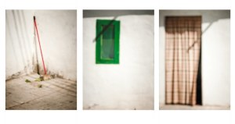
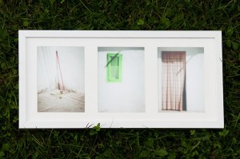

Hola,

regalo un cuadro original mío llamado “La casa per escombrar” El primer lector que me deje un comentario en este artículo se lo regalo. Así, por la patilla, se lo regalo. Y si cree que no tengo manera de contactar con él que se ponga en contacto conmigo en lluis\_ribes @ hotmail.com y se lo haré llegar esté donde esté.

> “La casa per escombrar” , quien no tiene algo a barrer: un recuerdo, un sentimiento …

Descripción  
Las tres fotos que componen el cuadro son tres fotos originales mías. Estas tres fotos son:

-   “[La casa per escombrar – l’escombra –](http://www.flickr.com/photos/lluisr/5005297323/)” ( #100003/000001)
-   “[La casa per escombrar – la finestra –](http://www.flickr.com/photos/lluisr/5005908948/)“ ( #100004/000001)
-   “[La casa per escombrar – la porta –](http://www.flickr.com/photos/lluisr/5005934366/)” ( #100005/000001)

Todo el proceso desde la toma de la fotografía hasta el montaje pasando por la edición e impresión han sido realizados por mi personalmente mimando la calidad de todo el proceso.  
Este cuadro viene con un fantástico marco de Ikea de 52,5cm x 25,5cm y el correspondiente paspertú. Las tres fotografías (17,5cm x 12,35cm cada una) tienen en su dorso mi sello mi firma y la numeración correspondiente en mi obra. A continuación podéis ver una foto del cuadro:  
La foto no hace justicia a los colores, a la textura del papel de arte usado ni al volúmen espacial que crea un aura intrigante alrededor de la obra. Esto tan solo lo podrás sentir si eres el más rápido…  
pronto más!,

Lluís Ribes, 2010