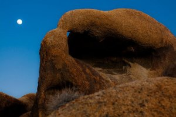
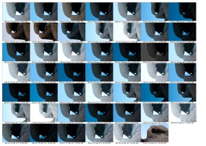
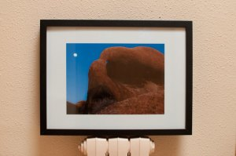

  
  
Buenos días,

otro cuadro acaba de salir del taller. Es una fotografía de mi [colección de fotos de Death Valley.](http://www.flickr.com/photos/lluisr/sets/72157623765310344/with/4488854164/show) La fotografía del cuadro se llama [“L’ull d’en Venkat i la lluna](http://www.flickr.com/photos/lluisr/4488854164/)“.Esta foto la realicé el primer día que estabamos fotografiando las [montañas Alabama Hills,](http://en.wikipedia.org/wiki/Alabama_Hills) una formación de montículos a los pies de Sierra Nevada con formas singulares y una cantidad moderada de caprichosos arcos. Visualicé este arco desde un pequeño cañón y comencé a jugar con la luna y el arco, por aquel entonces a punto de ser luna llena. Curiosamente esta fue la única toma horizontal que tomé:

Venkat es uno de los compañeros de la salida que también divisó esta pequeña maravilla y la estaba fotografiando desde hacía rato con su cámara 5 metros escondido delante mío tras unas rocas.

Este cuadro de corte clásico con un alto contraste de color ya ha sido adjudicado.  
Descripción  
La foto que compone el cuadro es:

-   “[L’ull d’en Venkat i la lluna](http://www.flickr.com/photos/lluisr/4488854164/in/set-72157623765310344/)” – (#100006/000001)

Todo el proceso desde la toma de la fotografía hasta el montaje pasando por la edición e impresión han sido realizados por mi personalmente mimando la calidad de todo el proceso.

Este cuadro viene con un fantástico marco negro de Ikea de 52,5cm x 25,5cm usando como fondo una cartulina blanca con un sútil relieve. La fotografía (19,7cm x 27,2cm) se ha plasmado sobre papel fotográfico sangrándolo totalmente y tiene en su dorso mi sello mi firma y la numeración correspondiente en mi obra.  
A continuación podéis ver una foto del cuadro:  
