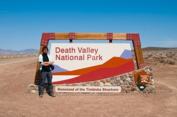
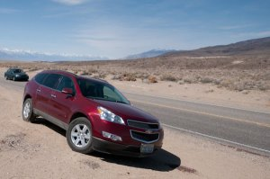

En este post os explico datos básicos para viajar al parque [Nacional de Death Valley](http://www.nps.gov/DEVA/index.htm) y a la región de [Lone Pine](http://en.wikipedia.org/wiki/Lone_Pine,_California), ambas en California (EEUU).

Death Valley es un parque nacional de los EEUU situado en el sur de [California](http://es.wikipedia.org/wiki/California), al este de las cordillera de [Sierra Nevada](http://en.wikipedia.org/wiki/Sierra_Nevada_%28U.S.%29) y hace frontera con el estado de [Nevada](http://es.wikipedia.org/wiki/Nevada). Es un desierto, y a pesar de estar relativamente cerca de la costa, le separan cinco cordilleras lo que hace que el aire húmedo del pacífico llegué sin una pizca de humedad. De hecho, es uno de los lugares donde llueve menos en todo el mundo y se registra unas temperaturas en verano de media de unos 40 grados. Otro factor que ayuda al clima desértico es que está formado por valles los cuales están en su mayoría por debajo del nivel del mar potenciando el efecto de la calor y creando un microclima de condiciones extremas. Podéis ver en este enlace una [tabla de las temperaturas](http://en.wikipedia.org/wiki/Death_Valley#Climate)

Lone Pine, por contra, es un pueblo situado a 100 kilómetros al noroeste de Death Valley que se situa en el valle de Owens y a pesar de ser también una zona muy desértica deja el clima extremo del valle de la muerte atrás. A Lone Pine y sus alrededores también se le conoce [como John Wayne’s Country por ser el lugar donde se rodó algunas de las películas de John Wayne](http://es.wikipedia.org/wiki/John_Wayne). El escenario es magnífico porque reposa a los pies de la gran cordillera de Sierra Nevada  
¿Cuándo visitarlo?

La mejor estación del año para visitar el parque de Death Valley es en primavera. Las tempeaturas son agradables y se puede observar las flores del desierto después de una tormenta. El problema de la primavera, es que está lleno y hay que reservar con antelación los lugares para dormir. El verano, demasiado calor. Invierno, noches realmente frías aunque los días después de Navidad son los días con menos visitantes del año y puede ser interesante si se busca tranquilidad. Otoño, parecido a la primavera, pero sin flores y con menos gente.

¿Cómo llegar?

El aeropuerto internacional más cercano es el de [Las Vegas](http://es.wikipedia.org/wiki/Las_Vegas), a 150 km. de Death Valley. Se llama el [McCarran Airport](http://www.mccarran.com/) y está en la misma ciudad. Desde Barcelona, el vuelo más directo es el de la aerolinia [Continental](https://www.continental.com/) que vuela de Barcelona a [Newark](http://es.wikipedia.org/wiki/Newark_%28Nueva_Jersey%29) (New York) y de Newark directamente a Las Vegas. Son aproximadamente 12 horas de vuelo más la escala en Newark. En mi caso, lo agarré a la vuelta y fue muy bien. Me sorprendió el vuelo de Newark a Barcelona en un [Boeing 757](http://es.wikipedia.org/wiki/Boeing_757) que tenía equipado para cada pasajero un sistema multimedia con decenas de juegos, películas y música. Imposible aburrirse. Para ir, opté por [Lufthansa](http://www.blogger.com/www.lufthansa.com): de Barcelona a Munich, de Munich a San Francisco y de San Francisco a Las Vegas. A pesar del largo viaje, no hubo ningún problema.

Una vez en Las Vegas, la mejor opción para llegar a Death Valley es con vehículo privado. Trenes, no hay. Buses, desconozco pero sinceramente no vi ninguno. Y avión, la verdad es que en EEUU se puede llegar a cualquier lugar con avión y el parque natural tiene algunos aeródromos. Por tanto, si puedes permitirte el lujo de alquilar una avioneta es una opción, pero sinceramente no tengo ni idea de cuanto puede costar y como hay que hacerlo. Yo os propongo coche o moto.

Yo agarré un coche, necesitaba maletero y me gusta ir sobre 4 ruedas. Alquilé el coche en el mismo aeropuerto ya que lo tienen muy bien resuelto. Hay aproximadamente unas [12 compañías de alquiler de coches](http://www.mccarran.com/03_carrentals.asp), casi todas de ellas abiertas las 24h. de tal forma que podemos agarrar el coche y dejarlo cuando queramos. A mi me fue útil, llegué a Las Vegas a la 1:30 de la mañana y tenía el coche preparado. Y lo devolví a las 12 de la noche sin problemas. Todas las compañías de alquiler de coches en el aeropuerto se situan en un [edificio a unos kilómetros de la terminal](http://maps.google.es/maps?f=q&source=s_q&hl=es&q=7135+Gilespie+St,+Las+Vegas,+Condado+de+Clark,+Nevada+89119,+Estados+Unidos&sll=55.950176,-3.187536&sspn=0.206071,0.416107&ie=UTF8&cd=2&geocode=Fb0-JgIdQL4i-Q&split=0&hq=&hnear=7135+Gilespie+St,+Las+Vegas,+Condado+de+Clark,+Nevada+89119,+Estados+Unidos&z=16), pero no hay problema, de la terminal sale cada 15/30 minutos durante las 24h. un bus gratuito hacia este edificio de los alquileres. Como véis, estáis en Las Vegas, la ciudad que nunca duerme…

En cuanto a las motos, no tengo ninguna referencia como conseguir una, pero si os gusta la moto y podéis conseguir una con características de trial, es un fantástico viaje para ello.

¿Qué coche alquilar?

La verdad es que con un coche normal se puede acceder a todos los lugares más interesantes de Death Valley y Lone Pine. Para llegar a estos lugares hay autopistas y carreteras en perfecto estado, y luego dentro de estos lugares hay carreteras secundarias y caminos de tierra que no requieren de ningún coche particular para circular por ellas (vaya si no llevas un deportivo pegado al asfalto o si no te importa dejar el coche sucio). Pero mi recomendación, sobretodo si eres un poco explorador es alquilar un coche con tracción a las cuatro ruedas como un [todoterreno](http://es.wikipedia.org/wiki/Autom%C3%B3vil_todoterreno) o un [SUV](http://es.wikipedia.org/wiki/SUV) . Con estos vehículos los caminos de tierra son más agradables y accesibles y puedes llegar a rincones que sin este tipo de coche sería imposible. También, si te gusta la conducción 4×4, hay muchas zonas como los cañones que suben las laderas de las montañas donde puedes poner a prueba tus habilidades. Pero no os emocionéis, estamos en un parque natural por tanto, la conducción fuera de las pistas está estrictamente prohibida.

En mi caso alquilé en [Hertz](http://www.hertz.es/) un SUV mediano ([Chevrolet Traverse](http://en.wikipedia.org/wiki/Chevrolet_Traverse)) con [GPS](http://es.wikipedia.org/wiki/Sistema_de_posicionamiento_global) y sistema de [radio via satélite (sistema Sirius)](http://en.wikipedia.org/wiki/Sirius_Satellite_Radio). El GPS me fue muy bien para moverme de noche por Las Vegas, pero fuera de Las Vegas, con un buen mapa no hay pérdida, es más, acabé adquiriendo un mapa gratis en una gasolinera de Nevada porque el GPS me llevaba por carreteras aburridas. En cuanto a la radio via satélite la verdad es que disponer de 50 emisoras de radio en zonas remotas como en las que puedes llegar a estar sin tener problemas de recepción es un lujo y os lo recominedo.

¿Qué carretera me lleva?  
Os voy a comentar la ruta que realicé, es decir de Las Vegas a Death Valley y luego a Lone Pine.

-   Salir de Las Vegas por la I15 dirección sur y coger la salida de Blue Diamond Road a unos 2 km. Continuar esta carretera recto y llegáis a la I160 donde hay que recorrer unos 50 km hasta llegar una salida hacia Calvada Springs. Llegado a este pueblo, coger la Old Spanish Trail Higway.
-   De Calvada Spring ir a Shoshone por la Old Spanish Trail Higway
-   Pasado Shoshone, a una milla hay un desvío hacia “Badwater” por la Highway 178. Esta carretera entra por el sur al parque y si la sigues llegas a Furnace Creek que podríamos decir que es el centro del parque.

Para ir a Lone Pine, en Furnace Creek está la Highway 190 que sale por el oeste del parque y a 33 millas de dejar el parque, si continuamos rectos por la Highway 136 llegamos a Lone Pine.  
Este recorrido no es el más directo, pero si que el que permite entrar más en contacto con el parque.  
Para los moteros, cuando se coge la Highway 160, hay una parada obligada a unas 17 millas desde el inicio de esta Highway 160. La parada se llama [Mountain Springs Bar](http://www.mtnspringssaloon.com/) y es un bareto de carretera para vosotros…  
A continuación tenéis con detalle el recorrido propuesto:

  
[Ver mapa más grande](http://maps.google.es/maps?f=d&source=embed&saddr=las+vegas&daddr=calvada+springs+to:Shoshone,+Condado+de+Inyo,+California,+Estados+Unidos+to:badwater+to:furnace+creek+to:lone+pine&geocode=FdYQJwIdMJoi-SnRffWkgre-gDGjebPV5tXMOg%3BFU3VJAIdKJUX-Slpty_y2RDGgDFewik_c3dYbg%3BFZrnJAId3dcR-SmfFnPzr1fGgDGVo9iUKvkvBg%3BFVufKAIdNUgK-SlprOvXph_HgDEX857qkxu1jA%3BFRROLAIdGrEI-SlzXfVWBz_HgDE26Fu74GJILQ%3B&hl=es&mra=ls&sll=36.151182,-116.021118&sspn=1.594526,3.14209&ie=UTF8&ll=36.151182,-116.032104&spn=1.330644,1.647949&z=8)  
 

En verano, llevar agua en garrafa en el coche. No se que te puede pasar si se te estropea el coche y debes de esperar aunque solo sea 20 minutos a que te venga la asistencia bajo un sol de justicia, a más de 40 grados de temperatura y con un aire que te quema los pulmones.

¿Dónde dormir?

La recomendación en Death Valley es alojarse dentro del parque. Hay múltiples lugares de acampada y si se quiere una cama, hay tres resorts donde hay que reservar con antelación, dado que suelen llenarse rápidamente sobretodo en primavera:

-   [Furnace Creek](http://www.furnacecreekresort.com/): en el centro del valle y con todas las comodidades disponibles: un gran restaurante donde comer unos buenos filetes, supermercado etc. El alojamiento es caro y quizá no es del todo lo tranquilo que puedas esperar.
-   [Stovepipe Wells](http://www.stovepipewells.com/): aquí estuve yo. Alojamiento a partir de 100$, habitaciones sencillas. Hay una pequeña tienda. Más tranquilo que Furnace Creek y no está mal situado.
-   [Panamint Springs](http://www.deathvalley.com/psr/): queda en el límite del parque, en el oeste. Quizá un poco alejado de los lugares más interesantes, pero una buena opción si no te importa hacer kilómetros.

Los tres resorts cuentan con gasolinera, restaurante y zona de camping.

En cuanto a Lone Pine y sus alrededores, hay múltiples moteles y también se puede hacer noche en alguna población próxima dado que lo interesante de esta zona está a lo largo del valle donde se situa el pueblo de Lone Pine. En mi caso estuve en el [motel Dow Villa](http://www.dowvillamotel.com/), dicen que es donde dormía John Wayne cuando rodaba sus películas. No era barato, unos 80$ pero la habitación estaba muy bien. Mucho mejor que en Stovepipe Wells por ejemplo.

¿Qué hacer?  
Bueno, la gran pregunta. Me imagino que si habéis llegado aquí será porque ya conocéis el parque de Death Valley o Lone Pine y tenéis claro el porque queréis ir y lo único que queréis es saber alguna cosa. Yo os hago un mini resumen y mis preferencias.  
Death Valley

-   Yo estuve en un curso de fotografía. Si a ti te va la fotografía y quieres hacer un viaje de fotos de paisajes (y además de paisajes desérticos) bienvenido al paraiso. Si quieres aprovechar los momentos de mejor luz, en una semana no te acabas este lugar.
-   No entiendo de 4×4, pero por lo que he podido comprobar hay montones de caminos de tierra algunos de ellos, solo mirándolo por donde pasa en el Google Earth te da una idea de lo divertidos que pueden ser. Tan solo hay que estar bien informado del tiempo. Casi nunca llueve, pero cuando lo hace, muchos de esos caminos se pueden transformar en rios de barro.
-   Trekking, la verdad es que hay más caminos en Lone Pine y Sierra Nevada para recorrer que en Death Valley pero la ausencia de caminos no impide realizar caminatas por infinidad de lugares del parque.

Lugares de interés:

-   [Badwater](http://en.wikipedia.org/wiki/Badwater_Basin): el lugar más bajo en toda américa del norte. Es un lago que en invierno está seco y se puede observar como la sal se extiende por todo el valle. A mi me gustó mucho, si caminas por la sal la sensación de estar sol y en otro planeta es real. Accesible por carretera.
-   [Dante’s view](http://en.wikipedia.org/wiki/Dante%27s_View): mirador de todo el valle de la muerte. Las puestas de sol increíbles, las vistas también porque el valle es una combinación de texturas y colores. Es un buen lugar, . Accesible por carretera.
-   Father Crowley Point: otro mirador de todo el valle de Panamint. Interesante ya que te da la sensación de grandeza del parque. Accesible por carretera.
-   [Devil’s Gold Course](http://en.wikipedia.org/wiki/Devil%27s_Golf_Course#Devil.27s_Golf_Course): formaciones cristalinas de sal. Hay que verlo. La verdad es que no puedes hacer mucha cosa, caminar por el campo de las formaciones de sal es cansado porque debes ir con muuuuucho cuidado de no caerte. Accesible en coche por una camino.
-   [Zabrikies Point](http://en.wikipedia.org/wiki/Zabriskie_Point): conjunto de montículos que dibujan multitud de patrones y colores sobre la roca. La fotografia en la salida y puesta de sol es interesante, las sombras y texturas y formas de las montañas permiten trabajar la fotografía muy bien. Me gustó, aunque encontré a faltar una caminata por el lugar. Accesible por carretera.
-   [Racetrack Playa](http://es.wikipedia.org/wiki/Racetrack_Playa): y el misterio de las rocas que se mueven. Una playa con rocas que dejan detrás de si un rastro. Accesible con 4×4. No estuve pero tiene muy buena pinta sobretodo para hacer fotos.
-   Pueblos fantasmas: como Rhyolite, Leadfield,… tienen su encanto. Accesible en coche por caminos.
-   [Mesquite Dunes](http://en.wikipedia.org/wiki/Places_of_interest_in_the_Death_Valley_area#Mesquite_Sand_Dunes): las formaciones de dunas más grandes del parque (100 metros). El primer día no le encontré mucha gracia, pero no así cuando volví. No tienes sensación de estar solo porque siempre ves a algún grupo de personas a lo lejos tirándose por las dunas. Pero el encanto de las dunas siempre está, solo debes encontrar el momento. y lugar Accesible por carretera.

Si queréis más información de estos lugares y otros del parque podéis consultarlo: [http://en.wikipedia.org/wiki/Places\_of\_interest\_in\_the\_Death\_Valley\_area](http://en.wikipedia.org/wiki/Places_of_interest_in_the_Death_Valley_area)

Lone Pine

-   Fotografía de paisajes, excelente. Tienes de fondo la cordillera de Sierra Nevada, precioso .
-   Trekking, por toda la Sierra de Nevada hay recorridos muy interesantes por los bosques de las montañas. En el museo de Manzanar, me compré el mapa [Lone Pine Region: Recreation Topo Map & Guide](http://www.amazon.com/Lone-Pine-Region-Recreation-Guide/dp/0978581016) [de la editorial SierraMaps](http://www.amazon.com/Lone-Pine-Region-Recreation-Guide/dp/0978581016), y aunque no está pensado como mapa para guiarte por los caminos dado que la escala y la información es escasa para estos usos, si que te muestra todas las rutas que hay por las montañas de Sierra Nevada de la zona, que no son pocas, atravesando bosques, valles y lagos.

Lugares de interés:

-   [Alabama Hills](http://en.wikipedia.org/wiki/Alabama_Hills): una esplanada con montículos de rocas singulares y multitud de formas. Me gustó, y con coche te puedes mover muy bien y encontrar lugares tranquilos y bonitos entre las rocas. Se accede a través de la calle Whitney Portal Road de Lone Pine con coche.
-   [Manzanar](http://www.nps.gov/manz/planyourvisit/gulag-at-manzanar.htm): museo histórico sobre las deportaciones de ciudadanos de los EEUU de orígen japonés en la segunda guerra mundial por el gobierno americano. Está a 5 millas al norte de Lone Pine por la carretera principal y es interesante hacer una parada de 20 minutos para aprender un poco más de esa triste historia.

Enlaces  
[  
Fichero Google Earth viaje Death Valley](http://bbs.keyhole.com/ubb/ubbthreads.php?ubb=download&Number=895438&filename=20100411130056-4bc22a78f19e24.32689069.kmz): para usar en Google Earth y ver los lugares recomendados en este artículo sobre el mapa  
[Mis fotos](http://www.flickr.com/photos/lluisr/sets/72157623765310344/show): las fotografias mias del viaje. Están geolocalizados sobre el mapa de flikr/yahoo  
[Death Valley National Park](http://www.nps.gov/deva/index.htm): página oficial del parque Death Valley  
[The Sierra Web](http://www.thesierraweb.com/lonepine/): información de Lone Pine y alrededores  
[Summit Post](http://www.summitpost.org/area/range/176773/sierra-nevada.html): información trekking Sierra Nevada  
[Death Valley Drive](http://www.youtube.com/watch?v=9s6mp2sQOGo): un video casero de conducción por Death Valley