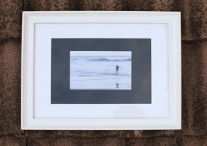

Hola,  
  
Bonjour,

tras el éxito del [primer cuadro que regalé a través del blog](http://lluisr.blogspot.com/2010/09/regalo-cuadro.html), vuelvo a regalar otra fotografía. Esta es una fotografía sin nombre del surfista en la playa azul. Esta foto la tomé una tarde mientras estaba con [Meritxell que practicaba el arte de la búsqueda del efecto seda sobre el agua](http://www.flickr.com/photos/mtxellmtxell/4727251353/in/photostream/). Era un día en que se estaba formando un temporal en las costas de Barcelona y apareció este surfista solitario decidido a adentrarse en las aguas del pueblo de Garraf. No solo entró en el mar sino que entró para siempre en esta foto para no salir jamás.

Après le succès de la [première photo oferte dans le blog](http://lluisr.blogspot.com/2010/09/regalo-cuadro.html), je reviens pour donner une autre image. Il s’agit d’un surfeur anonyme à la plage Blue. Cette photo a été prise un soir avec [Meritxell qui pratiqué l’art de trouver l’effet de la soie sur l’eau](http://www.flickr.com/photos/mtxellmtxell/4727251353/in/photostream/). C’était un jour où un orage se préparait au large de la côte de Barcelone et il est apparu que seul surfeur a décidé de s’aventurer dans les eaux du village de Garraf. Non seulement entrer dans la mer, il a plonger dans cette photo pour ne la jamais quitter.

¿Cómo conseguirlo?  
  
Comment puis-je la gagner?  
  
Si te quieres llevar esta foto en un bonito cuadro que sepas que solo podrá hacerlo uno de los diez primeros que me dejen un comentario en este artículo indicando que quieren participar y se agradece algún comentario sobre la foto. El viernes 22 de Octubre cerraré la lista de concursantes y daré a cada uno un número del 0 al 9. Quien tenga el número del reintegro de la primitiva del jueves 28 de Octubre se adjudicará la foto con el cuadro y se lo haré llegar.

Si vous voulez gagner cette photo dans une jolie boîte vous savez que vous ne pouvez faire l’un des dix premiers vous devez commenter cet article indiquant qui veulent participer et d’être reconnaissant de tout commentaire sur la photo. Le vendredi 22 Octobre la liste des candidats sera fermé et chacun aura un nombre de 0 à 9. Celui qui a le numéro de la réintégration de la loterie espanyole Primitiva, le jeudi Octobre 28 sera le nouveau propiétaire de l’oeuvre.

¿Qué pasa si hay menos de 10 concursantes? Anulo el sorteo.

¿Puedes concursar con varios apodos/nicknames? Vete al carajo si lo has pensado, obviamente no.Que faire si il ya moins de 10 candidats? Anulation de la loterie.  
Pouvez-vous en concurrence avec plusieurs alias / surnoms? Va te faire foutre si vous avez pensé ce-ci, évidemment pas.

Descripción  
DescriptionLa foto que compone el cuadro es:  
  
L’image du tableau est la suivante:

-   [(sin título)](http://www.flickr.com/photos/lluisr/4722704338/) – (#100007/0000001)

Todo el proceso desde la toma de la fotografía hasta el montaje pasando por la edición e impresión han sido realizados por mi personalmente mimando la calidad de todo el proceso.

L’ensemble du processus de prise de vue jusqu’à l’édition et l’impression ont été fait par moi personnellement cherchant l’haute qualité tout au long du processus.

Para el cuadro se ha usado un marco blanco(46cm x 36cm) que había pertenecido al fotógrafo [Pablo Porlán](http://3pfoto.blogspot.com/). La fotografía, que será firmada y serializada una vez adjudicado el cuadro, es de pequeño formato (17,5cm x 11,2cm) y está impresa sobre una cartulina blanca con verjura y centrada sobre un fondo gris verde mar que acompaña el tono azulado de la foto. Un paspertú blanco enmarca los elementos anteriores.

  
Pour la photo il s’utilisé un cadre blanc (46cm x 36cm) qui avait appartenu au photographe [Pablo Porlan](http://3pfoto.blogspot.com/). La photographie sera signé et numéroté après l’attribution de l’image, petite taille (17,5 cm x 11,2 cm) et est imprimé sur un carton blanc vergé et centré sur un fond gris qui accompagne la mer verte ton bleu photo. Un passe-partout blanc encadre les éléments.

Aquí una foto del cuadro listo y montado para llegar a un nuevo hogar:  
  
Voici une photo de prêt de la boîte et qui attend se retrouver avec sa nouvelle maison:  
