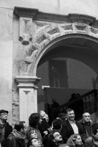
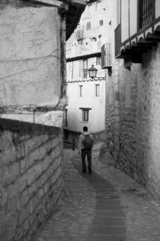
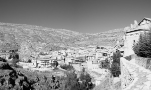

En este artículo os voy a hablar de los detalles del seminario de Fotografía y Periodismo de Albarracín. Por otro lado, iré colgando artículos sobre las conferencias que pasaron en esta edición. Estos artículos los tenéis accesibles desde los siguientes links:

-   [Conferencia Eugeni Forcano, Roser Martínez Rochina conversa con Eugeni Forcano](http://lluisr.blogspot.com/2010/10/eugeni-forcano-seminario-fotografia-y.html)
-   [Conferencia Cristóbal Hara, Un país imaginario](http://lluisr.blogspot.com/2010/10/cristobal-hara-seminario-fotografia-y.html)

¿Que és?

Este seminario que suele celebrarse en Octubre consiste en una serie de charlas, conferencias y proyecciones audiovisuales de fotografía que se realizan durante 4 días desde las 10:00 hasta las 20:00 horas. Si bien la temática que predomina es el fotoperiodismo otras ramas de la fotografía también son presentes. Además los asistentes tienen oportunidad que su Portfolio sea revisado por alguno de los conferenciantes invitados y hasta a optar a alguna beca que les permitirá el próximo año asistir gratuitamente y exponer su trabajo. El lugar, Albarracín, un enclave entre montañas a 20 km de Teruel, de lo que algunos dicen que es uno de los lugares más remotos de España.

 

Todo el evento está organizado por la fundación de Santa María de Albarracín y dirigido por el fotoperiodista [Gervasio Sánchez](http://es.wikipedia.org/wiki/Gervasio_S%C3%A1nchez). La verdad es que la organización es excelente.

¿Cómo apuntarse y llegar?

Toda la información del seminario en curso la tenéis siempre en [la web de la fundación Santa María de Albarracín](http://www.fundacionsantamariadealbarracin.com/). Normalmente las inscripciones salen a finales de Agosto pero el éxito del seminario en los últimos años es notable y hace que las plazas que suelen estar alrededor de 200 se acaben rápidamente. Por tanto hay que estar atentos y ser rápidos. Este año 2010, como excepción hemos sido 300 personas.

¿Cómo llegar?

Para llegar pocas opciones. Primera opción en bus desde Teruel ([podéis ver aquí horarios](http://www.estacionbus-teruel.com/index.php/lineas-y-horarios.html)), segunda opción con los buses que la organización pone a disposición desde Barcelona, Madrid o Zaragoza (este es el bus Barcelona que enlaza con Zaragoza ZZzzz…) o la última opción con coche propio. La verdad es que una vez allá el coche no se necesita para nada si no es que tienes problemas de movilidad y las calles baldosadas y empinadas del pueblo pueden ser un obstáculo. En tal caso, hay lugar para aparcar excepcionalmente allá donde se celebra el encuentro.

Alojamiento y comida

A pesar que Albarracín es remoto y pequeño (1000 habitantes), la gran cantidad de actividad cultural que se celebra allí a lo largo del año hace que los problemas de alojamiento sean raros (hay unos 20 hoteles/hostales). Además la organización ofrece una opción de inscripción con hotel y comida asegurado. La verdad es que esta opción está muy bien de precio y es muy cómoda aunque si quieres más intimidad o ir por tu cuenta pregunta en la oficina de turismo (ver abajo del todo) por los alojamientos del pueblo.

En mi caso estuve en un Hotel llamado [Caserón de la Fuente](http://www.caserondelafuente.es/). Precioso, un antiguo molino con una canal de agua que recorre el lateral de una de las paredes del edificio para posteriormente cambiar su trayectoria y atravesar el edificio por sus suelos. Habitaciones grandes, sencillas pero acogedoras y con mucha tranquilidad.

Caseron de la Fuente

C/ Carrerahuertos, s/n. 44100 ALBARRACÍN (Teruel)

www.caserondelafuente.es

Una cosa os comento de los menús que ofrece la opción de inscripción con alojamiento. Son un poco pesados y quizá algún día te apetezca buscarte un lugar para hacerte un bocadillo o comer algo más ligero. Para cenar hay una bocatería al lado del Gato en la calle principal que tienen unos bocatas buenísimos.

Por último no dejaré de comentaros por supuesto El Gato: bar de encuentro y copas tras las largas jornadas del seminario.

Mapa

A continuación tenéis un plano de Albarracín con los puntos de más interés de las jornadas y al final la dirección de información de turismo del pueblo

Ver [Albarracín](http://www.google.es/maps/ms?ie=UTF8&hl=es&t=h&msa=0&msid=110219521158979696837.00049346f7338ef846c47&ll=40.409281,-1.437707&spn=0.019606,0.025749&z=14&source=embed) en un mapa más grande

Oficina de Turismo Albarracín

tel: 978 710 262