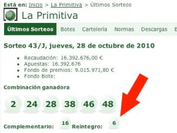

Ya tenemos ganadora [del concurso de la foto](http://lluisr.blogspot.com/2010/10/regalo-la-primera-fotografia-del.html)! Felicidades Conchi!! tú número 6 salió como reintegro. Tuya es la foto con ese fantástico marco.

Gracias a todos los participantes en este pequeño sorteo. Nos hemos hecho unas risas. Habrá más 🙂 y como regalo he buscado una cita bonita para vosotros:

> “Algunas personas miran el mundo y dicen ¿Por qué? Otras miran al mundo y dicen: ¿Por qué no?”

> [George Bernard Shaw](http://es.wikipedia.org/wiki/George_Bernard_Shaw)