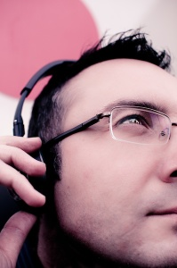
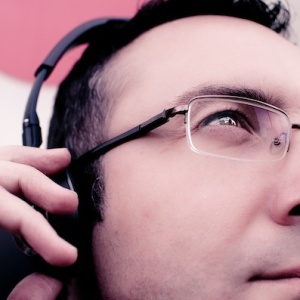

 

Francesc Vila – Lluís Ribes(c)

El jueves tuve la oportunidad de realizar un retrato a Francesc, compañero del curro, quien me había pedido días atrás una foto para [su cuenta de twitter](http://twitter.com/#%21/francesc_vila).

Cuando me lo pidió me lo hizo una mañana en la redacción extendiendo su brazo con un móvil para que lo usara como cámara. Lo intenté pero no soy [Ouka Leele](http://es.wikipedia.org/wiki/Ouka_Leele) y por tanto no puedo hacer aun una foto con el móvil que valga una exposición. Pero le dije que el día que bajara con la cámara aprovechariamos y le realizaría un retrato (la verdad creo que corría cierta urgencia porque su foto en el twitter hasta entonces era una improvisada foto de [Buzz Lightyear](http://en.wikipedia.org/wiki/Buzz_Lightyear): “Hasta el infinito y más allá!” 🙂 )  
Aprovechando que el jueves traía la cámara conmigo estuve atento para hacerle la foto y tras la comida me senté en mi puesto de trabajo. A mi derecha se sienta Francesc que me saluda y se coloca sus auriculares. En ese momento visualizo media foto: esos auriculares con los que escucha música de sus tiempos más guerreros. Le comento que allá a las 18:00 horas salimos un momento a la calle y le hago su foto.  
Pero a las 17:00 horas aproximadamente, tras los grandes ventanales de la redacción y a pesar que las cortinas traslúcidas están siempre bajadas se puede observar por un rincón como el sol se tiñe de naranja. Hora de hacer el break, ningún incidente en el trabajo, salimos.  
Nos dirigimos a la calle contigua, busco, miro, no veo ninguna luz especial pero a la vez se que es buena hora. El sol muy bajo tras los edificios del barrio regala un luz difusa, suave y le pido a Francesc que se ponga en un ventanal gris con un gran logo corporativo. Pregunta qué debe hacer a lo que respondo nada en especial, que se pusiera los cascos y mirase para los lados, que se relajara. Se pone los auriculares y otra vez la foto me viene, le pido que lo repita y que se quede en la posición de la colocación de los cascos sobre sus orejas. Mira hacia arriba le ordeno.  
Me gusta, veo el retrato, le pido que se congele y reviso las configuraciones de la cámara: manual, iso 200, temporizador desactivado, balance de blancos… da igual lo puedo ajustar en la edición, formato del fichero en raw. Hasta aquí todo ok. Ahora hay que decidir rápido, retrato: ojos enfocados y parcialmente el rostro. Selecciono diafragma a 4f. Medición de luz puntual a los ojos y configuramos la velocidad donde el fotómetro dice ok: 1/160. Hago una sencilla operación : 160 más grande que la distancia focal del objetivo que es 30 igual a que las condiciones de luz son más que suficientes. Vía libre para disparar. Francesc continua inmóvil como si se tratara de la misma fotografía que le iba a hacer.  
Hago dos fotos. Tiene buena pinta pero el encuadre americano no me encaja para una foto de perfil twitter. Me acerco a su rostro al límite de la distancia de enfoque, accentúo el contrapicado. Francesc es alto, grande pero además uno de los veteranos de la empresa. Situo el punto de enfoque en la montura de sus gafas cerca de sus ojos que miran como los de Buz Lightyear, al infinito y más allá. Disparo. Miro la pantalla. Genial. Veo la foto finalizada con un virado de sombras y luces al rojo y al azul. Apago la cámara y le digo ok con una sonrisa. Ha pasado escasamente dos minutos desde que salimos de nuestros puestos de trabajo. Volvemos y de mientras me siento como [Mark Guthirie:](http://www.markguthrie.com/)

“\[…\] Antes de la sesión procuro averiguar todo lo posible de la persona y saber por qué me ha pedido que la fotografíe. De este modo es más sencillo entablar una conversación. Sé lo que busco, y en vez de hacer tres o cuatro fotos con diferentes fondos, prefiero preservar hasta dar con al imagen perfecta. Entonces digo ‘Muchas gracias’ “

Mark Guthiere para el libro “[Lighting for portrait photography](http://www.amazon.com/Lighting-Portrait-Photography-Steve-Bavister/dp/2880465273)” de Steve Babister

Al día siguiente le traje la foto, le gustó y a mi me queda una sensación que a pesar que hace tiempo que no enfoco en mis fotos aun sigo reteniendo cierta habilidad.

Francesc Vila (versión twitter) – Lluís Ribes(c)