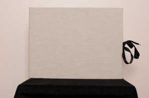
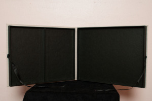
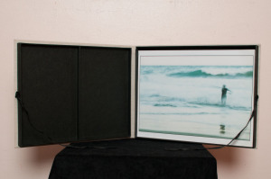

Os dejo unas fotos de mi primer prototipo de estuche. Es es el número 1, un estuche realizado a mano con cartón y forrado con en el interior con un papel negro y en el exterior con una tela de un color blanco roto.Sus medidas son 30cm x 23cm x 2cm y en su interior encontramos dos bandejas una grande con un compartimento de 29cm x 22cm y otra con dos compartimentos de 14cm x 22cm:

  
Este estuche diseñado por mi lo he construido en el taller de Begoña:

Charnela Encuadernación  
C/ Tordera, 8  
08012 Barcelona (Gracia)  
[www.charnela-enquadernacio.com](http://www.blogger.com/www.charnela-enquadernacio.com)  
e-mail: charnela@ya.com  
Tel: 93 458 73 60

Ahora ya estoy acabando el estuche número 2…