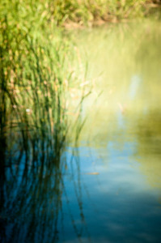
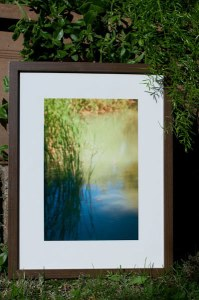

Este fin de semana he materealizado 4 fotografías creando sus respectivos cuadros. El primero y del que os voy a hablar a continuación es una fotografía que no he subido a [Flickr](http://www.flickr.com/photos/lluisr) como acostumbro a hacer pero la podéis ver aquí:

Son unas plantas acuáticas que estaban en una pequeña charca de [Funes (Navarra)](http://es.wikipedia.org/wiki/Funes_%28Navarra%29) en el antiguo cauce del río Arga. Tras un paseo por los alrededores de este puebecito tomamos un descanso al borde de la charca y comenzamos a hablar de los caballos de pura sangre. Entre tanto tecnicismo y glamour observaba a la vez la naturaleza. Simpre allí, a su ritmo, un ritmo muy diferente al de los humanos, sin descanso, la naturaleza sigue su ciclo.

Me descuelgo un poco de la conversación y realizo unas fotos con un enfoque difuso a algunos de los elementos de ese escenario. como son estas plantas acuáticas que salen a la atmosfera rompiendo la tensión superficial del agua.  
Me las imagino a estas plantas cada mañana cuando aparecen los primeros rayos de sol como se ven de coquetas reflejadas allí, como si de un pequeño tocador se tratara.  
La naturaleza nos habla y me topo con estas palabras de [Víctor Hugo](http://es.wikipedia.org/wiki/Victor_Hugo):

> “Produce una inmensa tristeza pensar que la naturaleza habla mientras el género humano no escucha”

Descripción  
La fotografía es una foto original mía:

-   “Els reflexos” (#100010/000001)

Todo el proceso desde la toma de la fotografía hasta el montaje pasando por la edición e impresión han sido realizados por mi personalmente mimando la calidad de todo el proceso. Para la fotografía (18,5 cm x 27,9 cm) se ha escogido una impresión con tinta mate sobre un papel 100% celulosa de 285gsm. creando un efecto cercano al de una obra de acuarela.

Para el cuadro, un marco color madera (32,5cm x 42,5cm) con un fondo de papel blanco satinado de 250g que aporta elegancia y nobleza junto al marco.  
Este es el resultado:  
  
Esta fotografía ya ha sido adjudica pero continuamos haciendo más y más.