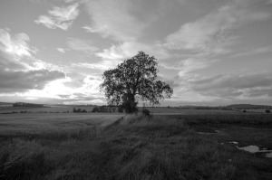
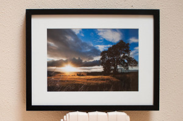

Os escribo sobre la penúltima foto que ha salido de mi taller convertido en un cuadro. Es la fotografía “[Això és Escòcia](http://www.flickr.com/photos/lluisr/2761896359/)” y la [realicé el penúltimo día de mi viaje de Escocia del 2008.](http://lluisr.blogspot.com/2008/08/da-11-escocia.html) Es una de mis fotografías preferidas por varios motivos.

El primero porque es la culminación de los conocimientos que fui adquiriendo en los primeros años de entrar en este mundo de las fotos. Libros como [Fotografía Digital Avanzada de Jay Kinghorn y Jay Dickman](http://www.agapea.com/libros/Fotografia-digital-avanzada-isbn-844152016X-i.htm), [horas y horas haciendo fotos con la gente de flickr](http://flickr.com/lluisr) por Catalunya y luego trabajándolas en casa o el pequeño curso que recibimos de [José María Mellado](http://www.mellado.info/) en [Menorca a la Vista 2007](http://www.jggweb.com/2007/05/05/menorca-a-la-vista/) me permitieron encontrar un encuadre genial, usar dos exposiciones para capturar este contraluz y trabajar con consciencia las zonas en el revelado del cuarto oscuro digital.El segundo motivo es porque es la foto que simboliza para mi el dicho “Quien la sigue la consigue“. Durante todo el viaje tenía en mente esta imagen, que en parte me obsesionaba, de un árbol en un campo con el sol y no fue hasta el día onceavo que la encontré. Recuerdo que era un día que estaba cansado, había practicamente pasado 4 horas buscando alojamiento y tras lograrlo decidí a última hora salir con el coche y perderme entre los campos de los alrededores de la torre de [Smailholm](http://www.discovertheborders.co.uk/places/5.html) en Melrose. [Hice la foto a la torre](http://www.flickr.com/photos/lluisr/2759872368/), [unos reflejos sobre el coche](http://www.flickr.com/photos/lluisr/2759026379), [autoretratos](http://www.flickr.com/photos/lluisr/2759027623) y algún que otro roble encontraba solitario en el camino pero no me convencía. Continuaba por la carretera y al llegar a una intersección giré a la izquierda y vi ese roble, majestuoso en el campo. Aquí os dejo en esclusiva la primera foto que tomé en un virado a blanco y negro:  
  
Aparqué el coche en un caserón en la intersección justo delante del escenario (pensé que vista más privilegiada que tienen desde la casa), planté trípode y a esperar que el sol fuera cayendo. Claro está que el contraluz me obligó a trabajar con varias exposiciones y en un momento que que el sol se escondió y volvió a surgir bajo una espesa nube con unos primerizos rayos de sol impactando mi lente, la cámara enregistró 20 tomas en pocos segundos. Estas tomas me sirvieron como base para la foto.  
El mérito de esta fotografía algunos dirán que es tan [solo de la naturaleza](http://en.wikipedia.org/wiki/Gaia_%28mythology%29), otros del [fotógrafo](http://hello.lluisribes.net/) por estar ahí, o de la [máquina por poder hacer tantas fotos por segundo](http://en.wikipedia.org/wiki/Nikon), otros del [Photoshop](http://en.wikipedia.org/wiki/Adobe_Photoshop) …

” ¿De quién es el mérito de la foto pues? de todos: Es un mérito del equipo que forma la naturaleza, la persona y la máquina. Trabajo en equipo.”

  
Descripción  
La foto que compone el cuadro es:

-   “[Això és Escòcia](http://www.flickr.com/photos/lluisr/2761896359/)” – (#100009/000001)

Todo el proceso desde la toma de la fotografía hasta el montaje pasando por la edición e impresión han sido realizados por mi personalmente mimando la calidad de todo el proceso.

Este cuadro usa un marco negro de 52,5cm x 25,5cm usando como un pastertú blanco. La fotografía (29,2cm x 20,2cm) está impresa sobre papel mate de 167g/m2 usando para ello tinta negra específica para este tipo de papel. En su dorso, mi sello firma y la numeración correspondiente en mi obra.  
A continuación podéis ver una foto del cuadro:

  
Esta fotografía fue entregada a su actual propietario.