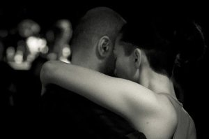
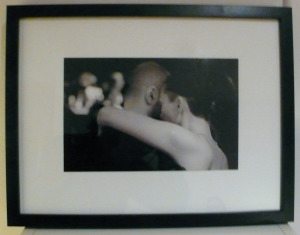

Mi última foto a día de hoy que ha salido de mi taller es “Deixa’t portar”. Ha salido en un cuadro.

Esta foto fue tomada en una milonga que se organiza cada fin de semana en locales de Barcelona. En ellas se reunen decenas de amantes del tango para bailar este sensual baile de pareja.

La pareja, “Conjunto de dos personas o dos animales destinados a hacer alguna cosa juntos” define el diccionario de [l’Insititut d’Estudis Catalans](http://dlc.iec.cat/).

¿Fácil verdad? Pues a veces puede ser muy complicado aunque un buen tango nos puede ayudar…

([ver en mi móvil](rtsp://v5.cache5.c.youtube.com/CjYLENy73wIaLQlSTM2KfN0ckhMYJCAkFEIJbXYtZ29vZ2xlSARSBXdhdGNoYIv5yvSBq7fuTAw=/0/0/0/video.3gp))

“Volver”, Carlos Gardel en El día que me quieras

"Yo adivino el parpadeo
de las luces que a lo lejos van
marcando mi retorno
son las mismas que alumbraron
con sus palidos reflejos
hondas horas de dolor
y aunque no quize el regreso
siempre se vuelve a su primer amor
la quieta calle, donde el eco dijo
tuya es mi vida, tuyo es mi querer
bajo el burlon, mirar de las estrellas
que con indiferencia, hoy me ven volver
Volver con la frente marchita
las nieves del tiempo, platearon mi sien
sentir que es un soplo la vida,
que 20 años no es nada
que febril la mirada
errante en la sombras te busca y te nombra
Vivir con el alma aferrada a un dulce recuerdo
que no ha de volver.
Tengo miedo el encuentro con el pasado
que vuelve a enfrentarse con mi vida
tengo miedo de las noches que pobladas
de recuerdos encadenan mi sufrir
pero el viajero que huye,
tarde o temprano detiene su andar
mas el olvido que todo destruye
haya matado mi vieja ilusion
Cual escondida la esperanza humilde
es toda la fortuna de mi corazon.
Volver con la frente marchita"

Descripción

La foto que compone el cuadro es:

-   “[Deixa’t portar](http://www.flickr.com/photos/lluisr/4926686867/)” – (#100011/000001)

Todo el proceso desde la toma de la fotografía hasta el montaje pasando por la edición e impresión han sido realizados por mi personalmente mimando la calidad de todo el proceso.  
Este cuadro usa un marco negro de 52,5cm x 25,5cm con un fondo de cartulina blanca Academia de 350 gr. Sobre ella la fotografía (25,5 cm x 16,5 cm) impresa sangrada sobre papel fotográfico liso brillante de 310/gm2.  
A continuación podéis ver una foto del cuadro:  
  
Este cuadro ya ha sido entregado a su propietario.