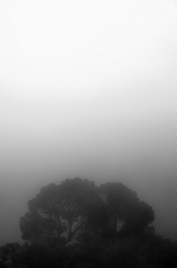
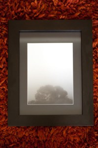

  
Esta foto hace tiempo que está expuesta en un salón, juntamente a otras pequeñas obras de arte, dentro de un sobrio pero elegante marco negro. Estos son unos pinos que hay en el [camino de Ronda entre el faro de Sant Sebastià, en Llafranc, y Tamariu](http://es.costabrava.org/suggestions/detail.aspx?t=los-caminos-de-ronda&com=UwB1AGcAZwBlAHMAdABpAG8AbgBJAEQAXAAxADkAXAA=), en los acantilados muy cerca del faro.  
Foto tomada a la tarde en un día que la niebla no se levantó de aquel lugar. Fue la compañera de esos pinos que aquel día no pudieron ver el espléndido mar Mediterraneo.  
Descripción  
La foto que compone el cuadro es:  

-   “[Pins a la boira](http://www.flickr.com/photos/lluisr/4636681472/)” – (#100008/000001)

Todo el proceso desde la toma de la fotografía hasta el montaje pasando por la edición e impresión han sido realizados por mi personalmente mimando la calidad de todo el proceso.

Este cuadro usa un marco negro de 52,5cm x 25,5cm sin paspertú con la fotografía sobre una cartulina gris oscuro con una tonalidad verde. La fotografía (20,5cm x 28 cm) está impresa sobre papel fotográfico. En su dorso, mi sello firma y la numeración correspondiente en mi obra.  
A continuación podéis ver una foto del cuadro:  
