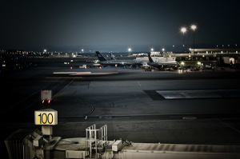

San Francisco Airport –[Lluís Ribes i Portillo(cc)](http://creativecommons.org/licenses/by-nc-nd/2.0/)

Tras un día de Navidad con la familia toca viajar un poco: 4 días en Tromso, círculo polar ártico Noruega, con mi hermano Guillem a la [búsqueda y captura de la Aurora Boreal](http://www.google.es/images?q=Aurora+Boreal.&oe=utf-8&rls=org.mozilla:es-ES:official&client=firefox-a&um=1&ie=UTF-8&source=univ&ei=6XcWTcPlGIm18QOrmuSEBw&sa=X&oi=image_result_group&ct=title&resnum=1&ved=0CCUQsAQwAA&biw=1118&bih=1085).

Ahora a descansar y a la mañana aviones con una escala en Oslo de 6 horas. De verdad, en Tromso no hace tanto frío:

You must have a browser that supports iframes to view the BBC weather observations