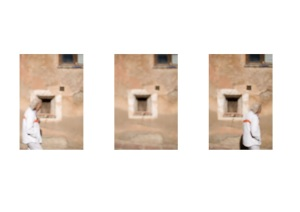
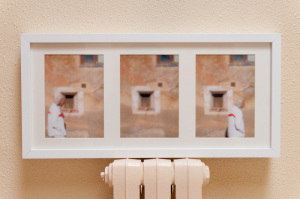

Hola,

Felices Reyes! Para celebrarlo voy a realizar el regalo de uno de mis cuadros originales. En este caso el cuadro es el de “La finestra tancada”, una ventana en el pueblo de Albarracín que es testigo del paso del tiempo…Es la primera obra del 2011, por tanto tendrá el honor de estrenar la numeración 11XXXX en mi serie. [Atrás dejamos las 11 obras del 2010](http://lluisr.blogspot.com/p/exposicion.html).

¿Cómo conseguirlo?

Si te quieres llevar esta obra, solo podrá hacerlo uno de los diez primeros que me dejen un comentario en este artículo indicando que quieren participar. El viernes 28 de Enero cerraré la lista de concursantes y daré a cada uno un número del 0 al 9. Quien tenga el número del reintegro de la primitiva del jueves 3 de Febrero se adjudicará el cuadro y se lo haré llegar.Si concursas y no estás seguro que yo tenga tus datos de contacto para hacerte llegar la obra si te tocara puedes enviármelos a lafinestratancada@lluisribes.net

Descripción  
Las tres fotos que componen el cuadro son tres fotos originales mías. Estas son:

-   “[La finestra tancada 10](http://www.flickr.com/photos/lluisr/5110712590/)” ( #110001/000001)
-   “[La finestra tancada 00](http://www.flickr.com/photos/lluisr/5110111367/)“ ( #110002/000001)
-   “[La finestra tancada 01](http://www.flickr.com/photos/lluisr/5110110625/)” ( #110003/000001)

Todo el proceso desde la toma de la fotografía hasta el montaje pasando por la edición e impresión han sido realizados por mi personalmente mimando la calidad de todo el proceso.

Este cuadro viene con un fantástico marco de Ikea de 52,5cm x 25,5cm y el correspondiente paspertú. Las tres fotografías (17,5cm x 12,35cm cada una) creadas sobre lienzo mate de gramaje de 390g/m2 tienen en su dorso mi sello mi firma y la numeración correspondiente en mi obra. A continuación podéis ver una foto del cuadro:  
